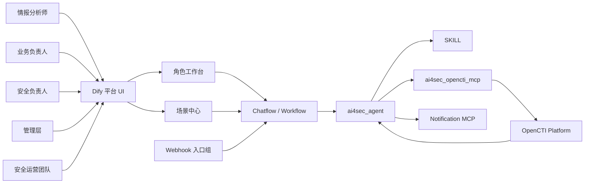
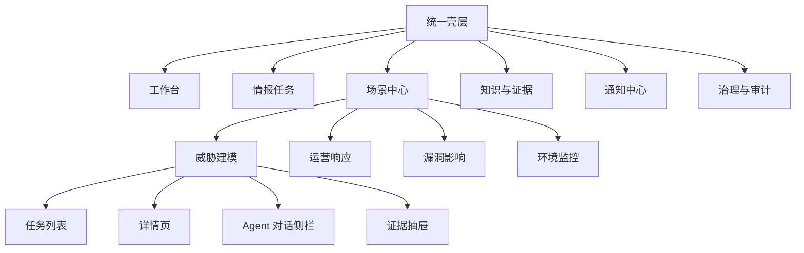
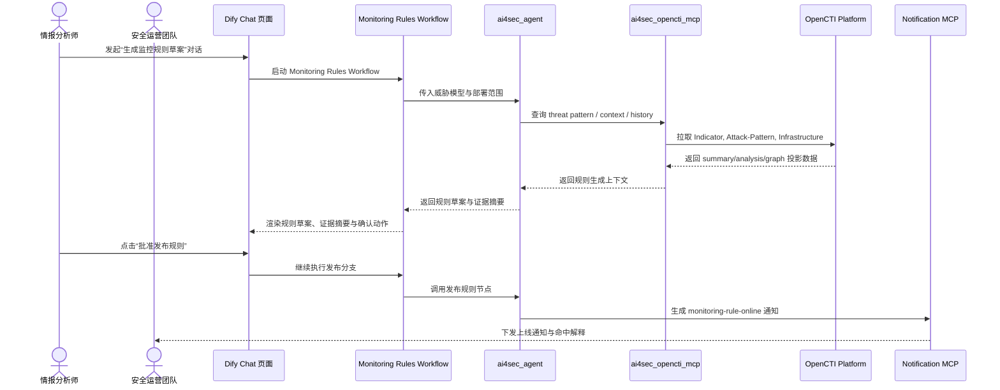

# AI4SEC应用层架构设计

## 1. 文档定位

本文档面向 ApplicationLayer（1209），基于 StrategyLayerAndMotivationAspect（1207）、BusinessLayer（1208）与四条价值流故事，定义 AI4SEC 的应用层交互结构、接口契约和协作边界。

| 项目 | 内容 |
| --- | --- |
| 上游输入 | StrategyLayerAndMotivationAspect（1207）、BusinessLayer（1208）、VS1（1223）、VS2（1225）、VS3（1222）、VS4（1224） |
| 应用层目标 | 让业务角色通过 DIFY 这一 Agent 工作流编排平台高效消费情报、执行决策、触发编排，并保持 STIX 2.1 语义一致性 |
| 核心组件 | DIFY（1212）、ai4sec_agent（1214）、ai4sec_opencti_mcp（1215）、OpenCTI platform（1216）、Notification MCP（1227） |
| 输出形式 | Markdown 文档；重点输出角色入口、应用服务、API/事件契约、通知合同 |
| 非目标 | 不描述部署拓扑、RBAC、SMTP 参数、缓存结构、限流算法、GraphQL 实现代码 |

## 2. 设计原则与边界

### 2.1 强制原则

| 原则 | 架构来源 | 应用层落地要求 |
| --- | --- | --- |
| Progressive Disclosure | 任务约束 + 业务层假设 | 文档按角色入口、场景导航、应用服务、接口契约、非功能边界逐层展开 |
| Separation of Concerns | 任务约束 + 业务层协作边界 | UI IA、Agent 编排、MCP 投影、OpenCTI 底座、通知合同分别描述，禁止混写 |
| 业务流程中所有数据都必须是 OPENCTI 平台中的 STIX2.1 标准数据 | 原则 1226 | 所有同步接口和异步事件都用 STIX 对象或其业务投影表达 |
| 全局情报底座：OPENCTI 平台 | 原则 1228 | 外部情报先进入 OpenCTI，再由内部事件或任务驱动 Agent |
| 统一智能入口：DIFY Agent | 原则 1229 | 角色主动交互和被动 webhook 调度统一收敛到 ai4sec_agent |
| 通知预警标准化通道 | 原则 1230 | 高级别结果统一通过 Notification MCP 下发 |

### 2.2 应用层边界

| 主题 | 应用层负责 | 不在本层处理 |
| --- | --- | --- |
| Dify UI / Chat 页面 | 角色入口、页面 IA、Agent 侧栏组织 | 前端技术栈、组件代码实现 |
| DIFY Chatflow / Workflow | 节点编排、上下文回查、链路控制、幂等保护语义 | 工作流引擎 YAML 细节、节点配置语法 |
| OpenCTI 访问 | 查询投影、版本策略、分页约束、错误语义 | GraphQL schema、索引设计、查询优化实现 |
| 通知 | 模板类型、角色映射、升级矩阵、幂等键合同 | SMTP 配置、邮箱账号、组织架构同步 |

## 3. 应用层总览

### 3.1 组件协作图

### 3.2 视图 164 解析结果

| 视图元素 / 关系 | 已确认语义 | 应用层含义 |
| --- | --- | --- |
| ai4sec_agent --(access opencti stix data)--> ai4sec_opencti_mcp | 关系 1082 | Agent 通过 MCP 访问经投影约束的 OpenCTI 数据 |
| ai4sec_opencti_mcp --(access情报数据)--> OpenCTI platform | 关系 1083 | MCP 是 OpenCTI 查询/写回的统一访问面 |
| OpenCTI platform --(主动推送STIX BUNDLE情报信息)--> ai4sec_agent | 关系 1086 | 内部事件与 webhook 回调从 OpenCTI 触发到 Agent |
| 各类情报消费者 --(消费情报)--> ai4sec_agent | 关系 1088 | 消费者通过 Agent 消费情报，而非直连底层系统 |
| ai4sec_agent --(发送预警通知)--> Notification MCP | 关系 1089 | 告警、审批、发布、监控通知统一由 Notification MCP 发送 |

## 4. 角色入口与信息架构

### 4.1 正式角色映射

说明：用户故事中的“研发安全负责人”统一归入“安全负责人”，“SOC 经理”统一归入“安全运营团队”，正式命名完全沿用业务层角色。

| 正式角色 | 默认落点 | 核心卡片 | 典型高频动作 | 不直接暴露的底层信息 |
| --- | --- | --- | --- | --- |
| 情报分析师 | 工作台 / 待研判任务 | 待受理情报、跨价值流待办、知识回灌入口 | 发起研判、补充上下文、确认规则草案 | GraphQL 原始查询、底层缓存状态 |
| 业务负责人 | 工作台 / 业务影响摘要 | 发布判定待确认、漏洞窗口期建议、业务影响摘要 | 确认业务影响、确认窗口期、接受/拒绝建议 | STIX 低层字段、检测规则实现细节 |
| 安全负责人 | 工作台 / 高风险审批 | 高风险审批、升级决策、跨团队处置视图 | 批准升级、批准发布阻断、指派治理动作 | 规则 DSL、通知通道配置 |
| 管理层 | 工作台 / 企业态势摘要 | 企业影响摘要、中断级态势卡片、资源优先级建议 | 决策优先级、确认资源投入、确认重大例外 | 资产图谱全量明细、IOC 细枝末节 |
| 安全运营团队 | 工作台 / 处置执行 | 事件分诊、规则上线、命中反馈、行动执行卡片 | 发布监控规则、执行响应动作、反馈命中结果 | 业务决策过程细节 |

### 4.2 页面级 IA

### 4.3 场景中心颗粒度

| 场景 | 列表页关注点 | 详情页关注点 | Agent 侧栏职责 | 证据抽屉职责 |
| --- | --- | --- | --- | --- |
| 威胁建模 | 待建模任务、发布风险分流 | 威胁模型、控制缺口、发布判定 | 追问推理、补充策略参数 | 查看 Attack-Pattern、Course-of-Action、Relationship |
| 运营响应 | 告警分诊、处置状态 | Incident 时间线、处置剧本 | 生成响应动作、解释分级原因 | 查看 Observed-Data、Incident、Indicator |
| 漏洞影响 | 漏洞优先级、影响资产范围 | 业务影响、修补窗口建议 | 融合外部漏洞与内部上下文 | 查看 Vulnerability、Software、Infrastructure |
| 环境监控 | 规则草案、上线状态、命中反馈 | 规则来源、保护目标、命中解释 | 翻译设计风险为监控规则 | 查看 Indicator、Attack-Pattern、Relationship |

## 5. 应用服务分层

### 5.1 分层模型

| 分层 | 主要职责 | 关键对象 / 能力 | 关联组件 |
| --- | --- | --- | --- |
| 体验层 | 承载工作台、场景中心、证据抽屉、通知中心 | 角色入口、页面 IA、审批动作 | Dify UI |
| 会话与编排层 | 承载 Chatflow / Workflow 的自然语言交互、节点调度、异步编排 | 任务上下文、工作流状态、回查幂等 | DIFY + ai4sec_agent |
| 应用服务层 | 把价值流抽象为统一场景服务 | 威胁建模、事件响应、漏洞影响、环境监控 | ai4sec_agent + SKILL |
| 情报访问层 | 提供字段投影、分页、关系深度控制、写回边界 | STIX 投影、对象回查、关系裁剪 | ai4sec_opencti_mcp |
| 情报底座层 | 提供统一事实源和对象关系图谱 | STIX 2.1、GraphQL、Bundle | OpenCTI platform |
| 通知输出层 | 发送发布判定、事件响应、漏洞预警、监控上线通知 | 模板、升级矩阵、幂等键 | Notification MCP |

### 5.2 Agent 工作流责任边界

| 工作流阶段 | 输入 | 输出 | 应用层责任 |
| --- | --- | --- | --- |
| 受理与分流 | 用户交互、内部 webhook、OpenCTI 事件 | 标准化任务上下文 | 把主动入口和被动入口统一收敛到 Chatflow / Workflow |
| 上下文回查 | 对象 ID、场景参数、角色视角 | MCP 投影结果 | 通过 MCP 工具节点回查上下文，不暴露缓存结构 |
| 场景推理 | STIX 事实、业务上下文、历史知识 | 风险结论、规则草案、处置建议 | 把复杂推理放在 Chatflow / Workflow 的 Agent 节点和侧栏交互中 |
| 结果沉淀 | 结论、证据、动作建议 | 写回 OpenCTI 的 STIX Bundle | 通过 MCP / 工具节点写回，保证对象满足 STIX 语义 |
| 通知与反馈 | 发布结论、处置结果、规则上线结果 | 标准化通知与反馈事件 | 统一走 Notification MCP 节点并按严重级别升级 |

## 6. 价值流到应用层映射

| 价值流 | 应用场景名 | 主要角色 | 主入口 | 共享能力复用 | 主要输出 |
| --- | --- | --- | --- | --- | --- |
| VS1 威胁建模 | 威胁建模 | 情报分析师、安全负责人、业务负责人 | Dify Chat 页面 + Pipeline Webhook 触发 Workflow | 任务、上下文、知识、通知 | 威胁模型、发布判定、整改建议 |
| VS2 运营响应 | 运营响应 | 情报分析师、安全运营团队、安全负责人 | Dify Chat 页面 + SIEM Webhook 触发 Workflow | 任务、知识、通知 | Incident、响应动作、复盘摘要 |
| VS3 漏洞影响 | 漏洞影响 | 情报分析师、业务负责人、管理层 | Dify Chat 页面 + OpenCTI 事件触发 Workflow | 上下文、知识、通知 | 影响面、优先级、决策摘要 |
| VS4 环境监控 | 环境监控 | 情报分析师、安全运营团队、安全负责人 | Dify Chat 页面 + OpenCTI 事件触发 Workflow | 任务、上下文、知识、通知 | 监控规则、上线通知、命中反馈 |

## 7. DIFY 编排入口与统一契约

### 7.1 编排入口分组

| 分组层级 | 编排入口 | 说明 |
| --- | --- | --- |
| 人机交互入口 | Dify Chat 页面 / 会话入口 | 情报分析师与各类消费者发起交互、审批与追问 |
| 共享能力节点 | Task 节点 / Context 节点 / Knowledge 节点 / Notification 节点 | 在 Chatflow / Workflow 中复用共享能力 |
| 场景工作流 | Threat Modeling Chatflow / Incident Response Workflow / Vulnerability Intelligence Workflow / Monitoring Rules Workflow | 四条价值流分别映射到独立工作流 |
| 异步回调 | `/webhooks/opencti/*` | OpenCTI 到 Workflow 的内部事件入口 |
| 异步回调 | `/webhooks/pipeline/*` | CI/CD、设计输出等工程入口 |
| 异步回调 | `/webhooks/siem/*` | 观测系统、SIEM、NDR 入口 |

### 7.2 统一契约规则

| 维度 | 统一规则 |
| --- | --- |
| 编排命名 | Workflow / Chatflow 名称与价值流场景保持一一对应，避免业务含义漂移 |
| 版本策略 | 工作流版本由 DIFY 平台管理；异步事件命名使用 `ai4sec.<domain>.<event>.v1` |
| 小版本策略 | 工作流小改动不更名，仅记录 `schema_revision` 或文档修订号 |
| 认证方式 | 人机交互继承 DIFY 平台会话鉴权；Webhook 与 MCP 使用独立凭证，具体实现需人工确认 |
| 幂等要求 | webhook 消费与通知发送使用 `dedup_key`；同一对象的重复触发不得重复落库 |
| 错误码规则 | 域前缀 + 四位数字 |

### 7.3 错误语义基线

| 错误码 | 语义 | 适用场景 |
| --- | --- | --- |
| `VAL-4001` | 参数校验失败 | 请求体缺字段、枚举非法 |
| `AUTH-4010` | 身份校验失败 | 会话过期、凭证无效 |
| `AUTH-4030` | 权限不足 | 角色无审批动作资格 |
| `CTI-4041` | STIX 对象不存在 | MCP 回查目标不存在 |
| `MCP-4090` | 字段投影冲突 | 请求字段与投影规则冲突 |
| `RATE-4290` | 查询配额触发 | OpenCTI 查询被限流 |
| `ASYNC-4990` | 异步处理超时 | 回调任务未在 SLA 内完成 |
| `UPSTREAM-5020` | OpenCTI 或外部上游异常 | 上游服务错误或不可用 |
| `NOTIFY-5030` | 通知投递失败 | 通知通道不可达 |

## 8. ai4sec_opencti_mcp 查询投影合同

### 8.1 投影档位

| 档位 | 返回范围 | 典型使用者 |
| --- | --- | --- |
| `minimal` | `id`、`type`、`standard_id`、`name`、`modified` | 列表页、任务卡片 |
| `summary` | `minimal` + `description`、`labels`、`confidence`、关键外部引用 | 详情页首屏、审批摘要 |
| `analysis` | `summary` + `object_marking_refs`、关键关系摘要、核心扩展字段 | 情报分析师侧栏研判 |
| `graph` | 对象本体 + 一跳关系 | 证据抽屉、图谱核验 |
| `notification` | 通知模板所需标题、摘要、优先级、目标角色字段 | Notification MCP 预览和投递 |

### 8.2 请求参数合同

| 参数 | 说明 | 默认值 / 限制 |
| --- | --- | --- |
| `projection_profile` | 预置投影档位 | 默认 `summary` |
| `fields[]` | 显式字段白名单 | 与档位叠加，需合法 |
| `exclude_fields[]` | 排除字段 | 默认空 |
| `include_relationships` | 是否带关系摘要 | 默认 `false` |
| `relationship_depth` | 关系深度 | 默认 `0`，最大建议 `1` |
| `relationship_types[]` | 指定关系类型 | 默认空 |
| `page_size` | 分页大小 | 默认 `20`，最大 `100`；`graph` 默认 `10`，最大 `30` |
| `cursor` | 游标分页起点 | 默认空 |

### 8.3 MCP 特定失败码

| 错误码 | 语义 |
| --- | --- |
| `MCP-4001` | 投影档位不存在 |
| `MCP-4002` | 字段名非法 |
| `MCP-4003` | 字段与对象类型不匹配 |
| `CTI-4091` | 对象状态冲突 |
| `ASYNC-5040` | 查询超时 |

### 8.4 合同边界说明

- OpenCTI webhook 回查缓存只作为 Agent 侧性能与幂等保护机制，不在应用层展开缓存结构。
- GraphQL 查询限流只表达为查询配额与退避要求，不描述令牌桶或具体算法。
- 字段裁剪能力只体现为 MCP 响应投影合同，不下沉到 GraphQL 字段映射实现。

## 9. Notification MCP 最小通知合同

### 9.1 模板类型

| 模板类型 | 对应场景 | 主要接收角色 |
| --- | --- | --- |
| `release-gate-decision` | 发布判定 | 安全负责人、业务负责人 |
| `incident-response` | 事件响应 | 安全运营团队、安全负责人 |
| `vulnerability-alert` | 漏洞预警 | 业务负责人、管理层、安全负责人 |
| `monitoring-rule-online` | 监控上线 | 安全运营团队、安全负责人 |

### 9.2 通用字段

| 字段 | 说明 |
| --- | --- |
| `template_type` | 模板类型 |
| `message_title` | 标题 |
| `message_summary` | 摘要 |
| `business_impact` | 业务影响 |
| `recommended_action` | 建议动作 |
| `evidence_link` | 证据入口 |
| `primary_role` | 主责角色 |
| `approver_role` | 审批角色 |
| `cc_roles[]` | 抄送角色 |
| `severity_tier` | 严重级别 |
| `escalate_after_minutes` | 升级等待分钟数 |
| `event_type` | 事件类型 |
| `object_refs[]` | STIX 对象引用 |
| `dedup_key` | 幂等去重键 |
| `channels[]` | 渠道列表，默认 `email` |

### 9.3 收件人与升级矩阵

| 严重级别 | 触发条件 | 收件人层级 | 升级策略 |
| --- | --- | --- | --- |
| 普通 | 单系统、非生产或中风险事项 | 仅主责人 | `escalate_after_minutes=240` |
| 高 | 生产关键资产、高风险结论、跨团队协同 | 主责人 + 审批人 + 必要抄送 | `escalate_after_minutes=30` |
| 中断级 | 核心链路中断、重大漏洞确认影响核心业务、正在发生的高置信事件 | 主责人 + 审批人 + 管理层 + 安全运营团队值守 | `escalate_after_minutes=10` |

### 9.4 抄送与幂等

- 仅当满足“跨团队依赖”“需业务窗口确认”“需管理层知悉”之一时填充 `cc_recipients`。
- `dedup_key` 采用 `{template_type}:{object_id}:{severity_tier}:{business_date}`。
- 应用层只说明角色映射、消息结构和升级规则，不描述 SMTP、组织架构同步或权限控制实现。

## 10. 七段式编排契约样板

说明：这里的“七段式”不再表示平台内必须存在独立 REST 资源接口，而是表示 DIFY 工作流触发面、调用关系、输入输出载荷、异步事件和错误语义的统一表达。VS1 至 VS3 复用本节规则；完整样板按任务要求使用 VS4 主链路展开。

### 10.1 VS4 主链路时序

### 10.2 VS4 同步交互样板

| 七段式 | `启动 Monitoring Rules Workflow` | `继续执行发布分支` | `打开证据抽屉 / 请求证据投影` |
| --- | --- | --- | --- |
| 编排目录 | 场景工作流 / VS4 | 场景工作流 / VS4 | 场景详情 / 证据抽屉 |
| 调用方 / 被调用方 | Dify Chat 页面 -> Monitoring Rules Workflow -> ai4sec_agent | Dify Chat 页面 -> Monitoring Rules Workflow -> ai4sec_agent | Dify Chat 页面 / Agent 侧栏 -> ai4sec_opencti_mcp |
| 认证方式 | DIFY 会话鉴权，需具备规则设计动作资格 | DIFY 会话鉴权，需具备发布动作资格 | DIFY 会话鉴权 |
| 输入载荷关键字段 | `task_id`、`attack_pattern_id`、`software_id`、`security_goal`、`deployment_scope`、`projection_profile` | `rule_id`、`publish_reason`、`primary_role`、`approver_role`、`channels[]`、`idempotency_key` | `projection_profile`、`include_relationships`、`relationship_depth` |
| 输出载荷关键字段 | `rule_draft_id`、`indicator_pattern`、`pattern_type`、`coverage_summary`、`evidence_refs[]`、`warnings[]` | `rule_id`、`publish_status`、`notification_preview`、`event_name`、`schema_revision` | `rule_id`、`indicator`、`attack_pattern`、`evidence_bundle_summary`、`next_cursor` |
| 错误语义 | `VAL-4001`、`CTI-4041`、`MCP-4003`、`RATE-4290`、`UPSTREAM-5020` | `AUTH-4030`、`CTI-4091`、`NOTIFY-5030`、`ASYNC-4990` | `CTI-4041`、`MCP-4002`、`ASYNC-5040` |
| 版本策略 | Workflow 版本 + `x-contract-revision` | Workflow 版本 + `x-contract-revision` | Workflow 版本 + `x-contract-revision` |

### 10.3 VS4 异步事件样板

| 事件名 | 触发条件 | STIX 对象类型 | 消息体关键字段 | 重试语义 |
| --- | --- | --- | --- | --- |
| `ai4sec.monitoring-rules.rule-drafted.v1` | 规则草案生成成功 | `Indicator`、`Attack-Pattern`、`Note` | `event_id`、`rule_draft_id`、`object_refs[]`、`severity_tier`、`schema_revision` | 幂等消费；同一 `rule_draft_id` 重放不重复创建草案 |
| `ai4sec.monitoring-rules.rule-published.v1` | 规则正式发布 | `Indicator`、`Relationship`、`Note` | `event_id`、`rule_id`、`object_refs[]`、`primary_recipients`、`dedup_key` | 失败重试，使用 `dedup_key` 去重 |
| `ai4sec.monitoring-rules.hit-detected.v1` | 规则命中并进入反馈 | `Indicator`、`Observed-Data`、`Incident` | `event_id`、`rule_id`、`hit_count`、`object_refs[]`、`business_impact` | 至少一次投递，消费者按 `event_id` 幂等 |

## 11. 其他价值流复用模板

| 价值流 | 主编排入口 | 异步入口 | 复用的共享能力 | 重点差异 |
| --- | --- | --- | --- | --- |
| VS1 威胁建模 | Threat Modeling Chatflow / Workflow | `/webhooks/pipeline/changes` | tasks、context、knowledge、notifications | 输出发布判定与控制缺口 |
| VS2 运营响应 | Incident Response Workflow | `/webhooks/siem/alerts` | tasks、knowledge、notifications | 输出 Incident 与处置剧本 |
| VS3 漏洞影响 | Vulnerability Intelligence Workflow | `/webhooks/opencti/vulnerabilities` | context、knowledge、notifications | 输出影响面、优先级与决策摘要 |

## 12. 非功能合同约束

| 主题 | 合同约束 |
| --- | --- |
| 响应粒度 | UI 默认先请求 `summary` / `notification`，情报分析师在证据抽屉按需请求 `analysis` / `graph` |
| 分页 | 统一使用 cursor；避免 offset |
| 幂等 | webhook 入口、通知发送、规则发布都必须使用对象 ID + 业务日期去重 |
| 性能 | OpenCTI 回查缓存只承诺“减少重复回查”，不暴露内部机制 |
| 审计 | 所有重要动作需返回 `task_id`、`object_refs[]`、`schema_revision` 以便追溯 |

## 13. 结论

本应用层设计把五类正式业务角色统一收敛到一个“统一壳层 + 角色工作台 + 场景中心”的交互框架内，并以 ai4sec_agent 作为唯一智能入口，衔接 ai4sec_opencti_mcp、OpenCTI platform 与 Notification MCP。文档同时定义了共享 API 域、场景 API 域、Webhook 分组、字段投影合同、最小通知合同与 VS4 七段式样板，使应用层既能快速被人理解，也能为后续实现保持边界清晰。