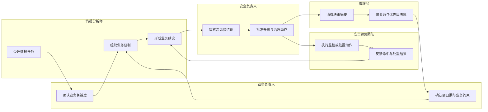

# AI4SEC业务层架构设计

## 1. 文档定位

本文档面向 `BusinessLayer`（1208），基于战略动机层 4 条价值流对 AI4SEC 的业务层进行首轮建模，作为当前迭代的正式交付物。

| 项 | 内容 |
| --- | --- |
| 上游输入 | `StrategyLayerAndMotivationAspect`（1207）、VS1（1223）、VS2（1225）、VS3（1222）、VS4（1224） |
| 业务目标 | 支撑快速的情报生产和消费（1221），形成从威胁建模、运营响应、知识进化到环境感知监控的业务闭环 |
| 数据原则 | 业务流程中的业务数据统一以 OPENCTI 中的 STIX 2.1 标准对象为业务语义载体（1226） |
| 平台边界 | OPENCTI 是全局情报底座（1228）；DIFY Agent 是统一智能入口（1229）；Notification MCP 是通知预警标准化通道（1230） |
| 本轮范围 | 仅输出业务层设计文档，不修改 `SystemArchitecture.json`，不下沉到应用接口、部署配置或容器编排 |

### 1.1 本轮假设

| 假设项 | 说明 |
| --- | --- |
| 文档命名 | 按任务要求，交付文件命名为《AI4SEC业务层架构设计》并采用 Markdown 承载 |
| 建模粒度 | 采用“业务角色 -> 业务能力 -> 业务服务 -> 业务流程 -> 业务对象 -> 治理视图”的 Progressive Disclosure 顺序 |
| 元素落地方式 | 当前仅在文档中定义 ArchiMate 业务元素，所有新元素均标记为 `需新增架构元素` |
| 角色拆分 | 将“各类情报消费者”细化为业务负责人、安全负责人、管理层，并补充安全运营团队角色 |

## 2. 战略价值流到业务层的映射

| 价值流 | 战略诉求 | 业务结果 | 核心业务角色 | 关键业务对象 |
| --- | --- | --- | --- | --- |
| VS1 威胁建模闭环 | 在持续交付前识别新威胁并形成发布判定 | 可追溯的威胁模型、缓解建议、发布结论 | 情报分析师、业务负责人、安全负责人 | 情报任务、威胁模型、控制措施、发布判定 |
| VS2 威胁运营与响应闭环 | 将告警升级为可执行响应动作并形成复盘资产 | 事件分诊结论、响应动作、复盘摘要 | 情报分析师、安全运营团队、安全负责人 | 事件档案、证据链、响应动作、复盘记录 |
| VS3 动态知识进化闭环 | 将外部漏洞转化为企业化影响结论与管理决策 | 影响范围、优先级建议、管理层决策摘要 | 情报分析师、业务负责人、管理层 | 漏洞情报、资产影响面、风险结论、决策摘要 |
| VS4 环境感知监控闭环 | 把设计期威胁模式转化为运行期可消费监控能力 | 监控规则、命中解释、持续校准反馈 | 情报分析师、安全运营团队、安全负责人 | 监控规则、命中记录、反馈结论、知识回灌 |

## 3. 业务参与者模型

### 3.1 业务角色清单

| 业务角色 | 架构来源 | 类型 | 核心职责 | 主要消费/产出 |
| --- | --- | --- | --- | --- |
| 情报分析师 | 已存在元素（1219） | Business Role | 定义任务边界、组织研判、维护知识闭环 | 消费外部/内部情报，产出研判结论、威胁模型、响应建议 |
| 业务负责人 | `需新增架构元素` | Business Role | 提供业务优先级、确认业务影响、协调窗口期与业务例外 | 消费影响分析、发布判定，产出业务优先级与风险接受意见 |
| 安全负责人 | `需新增架构元素` | Business Role | 审核高风险结论、批准治理动作、协调跨团队处置 | 消费风险结论、处置建议，产出治理指令与升级判定 |
| 管理层 | `需新增架构元素` | Business Role | 消费企业级影响摘要并进行资源与优先级决策 | 消费决策摘要、经营影响说明，产出决策意见与资源承诺 |
| 安全运营团队 | `需新增架构元素` | Business Role | 执行监控启用、事件处置、反馈命中效果 | 消费监控规则、处置动作，产出命中反馈、响应状态 |

### 3.2 角色协作边界

| 协作主题 | 主责角色 | 参与角色 | 协作边界 |
| --- | --- | --- | --- |
| 威胁建模立项 | 情报分析师 | 业务负责人、安全负责人 | 情报分析师组织建模，业务负责人确认业务上下文，安全负责人确认安全基线 |
| 事件响应升级 | 安全运营团队 | 情报分析师、安全负责人 | 运营团队执行动作，情报分析师提供研判依据，安全负责人做升级与资源协调 |
| 企业影响研判 | 情报分析师 | 业务负责人、管理层 | 情报分析师形成企业化结论，业务负责人提供业务关键度，管理层只消费摘要并决策 |
| 监控规则闭环 | 情报分析师 | 安全运营团队、安全负责人 | 情报分析师定义业务语义，运营团队执行和反馈，安全负责人评估规则有效性 |

## 4. 统一业务能力地图

### 4.1 一级能力域

| 一级能力域 | 元素状态 | 能力目标 | 对应价值流 |
| --- | --- | --- | --- |
| 情报接入与标准化 | `需新增架构元素` | 把外部输入、设计事实、运行告警和业务上下文收敛为统一业务语义 | VS1、VS2、VS3、VS4 |
| 情报研判与风险评估 | `需新增架构元素` | 将标准化情报转化为业务可用的风险结论、优先级与控制建议 | VS1、VS2、VS3 |
| 响应协同与处置编排 | `需新增架构元素` | 组织处置动作、升级路径与通知协同，驱动响应执行 | VS2、VS4 |
| 知识沉淀与持续优化 | `需新增架构元素` | 把结果、证据、命中与复盘沉淀为可复用知识资产 | VS1、VS2、VS3、VS4 |
| 治理与绩效管理 | `需新增架构元素` | 以角色责任、流程治理和 KPI 度量保障业务运行质量 | VS1、VS2、VS3、VS4 |

### 4.2 二级通用能力与边界

| 一级能力域     | 二级通用能力      | 服务对象         | 触发条件                | 关键输入                | 关键输出            | 责任角色        | KPI              |
| --------- | ----------- | ------------ | ------------------- | ------------------- | --------------- | ----------- | ---------------- |
| 情报接入与标准化  | 情报任务受理与分流   | 情报分析师、安全运营团队 | 新任务、新告警、新漏洞、新设计风险进入 | 情报任务、设计变更、观测数据、漏洞公告 | 已分流的业务任务        | 情报分析师       | 任务分流时效、待受理积压量    |
| 情报接入与标准化  | 业务上下文归并     | 情报分析师、业务负责人  | 需要把技术事实映射到业务场景      | 资产上下文、业务关键度、所有权信息   | 业务上下文摘要         | 情报分析师、业务负责人 | 上下文补全率、关键资产映射率   |
| 情报研判与风险评估 | 威胁与影响研判     | 情报分析师、安全负责人  | 需要得出威胁、事件或漏洞的业务影响   | 标准化情报、资产关系、历史知识     | 风险结论、优先级建议      | 情报分析师       | 高风险识别准确率、研判完成时长  |
| 情报研判与风险评估 | 控制缺口与处置建议生成 | 安全负责人、业务负责人  | 风险结论形成后             | 风险结论、现有控制、业务约束      | 控制措施、处置建议、例外建议  | 情报分析师、安全负责人 | 建议采纳率、控制缺口关闭周期   |
| 响应协同与处置编排 | 事件升级与动作编排   | 安全运营团队、安全负责人 | 告警或命中满足升级阈值         | 事件档案、处置模板、证据链       | 响应动作、升级记录       | 安全运营团队      | 平均响应时长、升级成功率     |
| 响应协同与处置编排 | 通知与决策协同     | 业务负责人、管理层    | 高风险结论、重大影响或关键命中出现   | 风险摘要、动作建议、业务影响说明    | 发布判定、管理决策、通知记录  | 安全负责人、管理层   | 决策闭环时长、关键通知送达率   |
| 知识沉淀与持续优化 | 证据链与知识资产沉淀  | 情报分析师、安全运营团队 | 任一流程完成或形成关键结论       | 事件结论、威胁模型、命中结果、处置记录 | 知识条目、复盘记录、可复用模板 | 情报分析师       | 复盘完成率、知识复用率      |
| 知识沉淀与持续优化 | 监控与规则持续校准   | 安全运营团队、安全负责人 | 规则命中、误报、漏报或新模式出现    | 命中记录、反馈结论、风险趋势      | 规则优化建议、监控优先级调整  | 安全运营团队      | 规则命中有效率、误报率下降幅度  |
| 治理与绩效管理   | 角色责任治理      | 全部业务角色       | 新流程上线、职责变化、审计复盘     | 角色清单、流程定义、例外记录      | RACI、治理要求、审计输入  | 安全负责人       | RACI 完整率、职责冲突数量  |
| 治理与绩效管理   | 业务绩效度量      | 管理层、安全负责人    | 周期性治理评估             | KPI 数据、流程表现、业务结果    | 绩效报告、改进项        | 管理层、安全负责人   | KPI 达标率、关键价值流闭环率 |

### 4.3 三级场景化业务服务

| 对应价值流 | 三级业务服务        | 元素状态      | 服务目标                 | 服务所有者  | 关键交付物            |
| ----- | ------------- | --------- | -------------------- | ------ | ---------------- |
| VS1   | 发布前威胁建模服务     | `需新增架构元素` | 在变更上线前给出可审计威胁模型与发布判定 | 情报分析师  | 威胁模型、控制建议、发布判定   |
| VS1   | 控制缺口复核服务      | `需新增架构元素` | 将威胁模型中的控制缺口转化为治理动作   | 安全负责人  | 整改清单、例外审批意见      |
| VS2   | 事件分诊与响应编排服务   | `需新增架构元素` | 把告警转化为可执行响应动作和升级路径   | 安全运营团队 | 事件分级、响应动作、升级记录   |
| VS2   | 事件复盘沉淀服务      | `需新增架构元素` | 把事件过程和结果沉淀为可复用知识资产   | 情报分析师  | 复盘摘要、知识条目、改进项    |
| VS3   | 外部漏洞企业化影响分析服务 | `需新增架构元素` | 将外部漏洞映射为企业受影响范围与优先级  | 情报分析师  | 影响分析、优先级建议、决策摘要  |
| VS3   | 高层决策支撑服务      | `需新增架构元素` | 为管理层提供可执行的资源与窗口期建议   | 管理层    | 决策意见、资源优先级、窗口期确认 |
| VS4   | 设计风险监控转译服务    | `需新增架构元素` | 将设计期威胁模式转化为运行期监控规则   | 情报分析师  | 监控规则定义、命中解释      |
| VS4   | 规则命中反馈校准服务    | `需新增架构元素` | 将运行结果反馈为规则优化和知识修正    | 安全运营团队 | 命中反馈、规则优化建议      |

## 5. 业务服务目录

| 业务服务          | 主要服务对象       | 触发事件              | 关键输入              | 关键输出           | 依赖的上游原则             |
| ------------- | ------------ | ----------------- | ----------------- | -------------- | ------------------- |
| 发布前威胁建模服务     | 业务负责人、安全负责人  | 新版本、重大变更、关键资产调整   | 架构变更、SBOM、历史威胁知识  | 威胁模型、发布判定、缓解建议 | 1226、1228、1229      |
| 事件分诊与响应编排服务   | 安全运营团队、安全负责人 | 高优先级告警、关键命中       | 观测数据、IOC、处置模板     | 分诊结论、处置动作、升级路径 | 1226、1228、1229、1230 |
| 外部漏洞企业化影响分析服务 | 业务负责人、管理层    | 新漏洞公告、重大零日、外部风险升级 | 漏洞情报、内部资产关系、业务关键度 | 影响面、优先级、行动建议   | 1226、1228、1229      |
| 设计风险监控转译服务    | 安全运营团队       | 设计评审完成、威胁模式新增     | 威胁模型、资产上下文、历史规则知识 | 监控规则、命中解释、校准输入 | 1226、1228、1229、1230 |
| 决策与通知协同服务     | 管理层、业务负责人    | 高风险结论、重大影响确认、关键命中 | 风险摘要、行动建议、业务影响说明  | 决策意见、通知记录、升级指令 | 1230                |

## 6. 关键业务流程设计

### 6.1 统一闭环流程

### 6.2 分价值流流程说明

| 价值流 | 触发条件 | 核心活动 | 主要业务对象 | 交付结果 |
| --- | --- | --- | --- | --- |
| VS1 威胁建模 | 新版本上线、架构变更、关键依赖变化 | 受理建模任务 -> 归并业务上下文 -> 输出威胁模型 -> 复核控制缺口 -> 形成发布判定 | 情报任务、威胁模型、控制措施、发布判定 | 可审计发布结论与整改清单 |
| VS2 威胁运营响应 | 高优先级告警、异常命中、人工升级 | 受理事件 -> 查询关联知识 -> 形成分诊结论 -> 编排处置动作 -> 沉淀复盘结果 | 事件档案、证据链、响应动作、复盘记录 | 闭环响应与复盘资产 |
| VS3 动态知识进化 | 外部漏洞公告、重大外部威胁、资产暴露变化 | 接入外部情报 -> 映射内部资产 -> 输出企业影响 -> 形成管理决策摘要 -> 回灌知识 | 漏洞情报、资产影响面、风险结论、决策摘要 | 企业化优先级与管理决策 |
| VS4 环境感知监控 | 新威胁模式、设计风险确认、规则校准需求 | 读取设计风险 -> 转译监控规则 -> 启用和运营规则 -> 反馈命中效果 -> 校准知识 | 监控规则、命中记录、反馈结论 | 高保真监控规则与持续校准闭环 |

## 7. 业务对象模型

### 7.1 一级业务对象簇

| 一级对象簇      | 元素状态      | 业务定义                   | 典型 STIX 语义映射                                  |
| ---------- | --------- | ---------------------- | --------------------------------------------- |
| 情报任务       | `需新增架构元素` | 代表一次待处理业务问题、任务请求或分析委托  | Task、Note、Report                              |
| 情报资产与业务上下文 | `需新增架构元素` | 表示与业务关键度、所有权和场景相关的上下文  | Software、Infrastructure、Identity              |
| 风险结论       | `需新增架构元素` | 表示威胁、漏洞、事件或设计风险的业务化判断  | Attack-Pattern、Vulnerability、Incident、Opinion |
| 响应动作       | `需新增架构元素` | 表示缓解、隔离、修复、升级和通知等可执行动作 | Course-of-Action、Note                         |
| 证据链        | `需新增架构元素` | 表示支撑结论和动作的证据、关系和关联上下文  | Observed-Data、Relationship、Report             |
| 通知与反馈      | `需新增架构元素` | 表示通知记录、命中反馈和决策摘要       | Note、Opinion、Indicator                        |

### 7.2 关键场景对象与状态流转

| 场景         | 关键对象   | 状态流转                              | 业务说明                 |
| ---------- | ------ | --------------------------------- | -------------------- |
| VS1 威胁建模   | 威胁建模任务 | 已创建 -> 已受理 -> 研判中 -> 待复核 -> 已判定   | 用于跟踪发布前威胁建模全过程及其责任归属 |
| VS2 威胁运营响应 | 事件档案   | 已接入 -> 已分级 -> 响应中 -> 待复盘 -> 已归档   | 体现事件从告警快照到复盘沉淀的闭环    |
| VS3 动态知识进化 | 漏洞影响结论 | 已接入 -> 已映射 -> 已评估 -> 已决策 -> 已回灌   | 体现外部漏洞向企业化结论进化的路径    |
| VS4 环境感知监控 | 监控规则   | 已提出 -> 已转译 -> 已启用 -> 已命中反馈 -> 已校准 | 体现设计风险向运行期监控能力的演进路径  |

## 8. RACI 责任矩阵

| 关键活动 | 情报分析师 | 业务负责人 | 安全负责人 | 管理层 | 安全运营团队 |
| --- | --- | --- | --- | --- | --- |
| 提交与受理情报任务 | R | C | I | I | C |
| 补充业务关键度与约束 | C | A | C | I | I |
| 输出风险结论与建议 | R | C | A | I | C |
| 审批高风险升级与治理动作 | C | C | A | I | R |
| 执行监控启用与响应处置 | C | I | A | I | R |
| 形成管理决策摘要 | R | C | C | A | I |
| 沉淀知识与复盘改进 | A | I | C | I | R |

## 9. KPI 与治理指标

| 一级能力域 | KPI | 指标定义 | 目标用途 |
| --- | --- | --- | --- |
| 情报接入与标准化 | 任务分流时效 | 从输入进入到完成业务分流的平均时长 | 评估受理效率 |
| 情报接入与标准化 | 关键资产映射率 | 已建立业务上下文映射的关键资产占比 | 评估上下文完备性 |
| 情报研判与风险评估 | 高风险识别准确率 | 高风险结论与后续复核一致的比例 | 评估研判质量 |
| 情报研判与风险评估 | 研判完成周期 | 从受理到形成风险结论的周期 | 评估业务响应能力 |
| 响应协同与处置编排 | 平均响应时长 | 触发升级后到关键动作执行完成的时长 | 评估处置效率 |
| 响应协同与处置编排 | 关键通知送达率 | 关键通知成功送达目标角色的比例 | 评估协同可靠性 |
| 知识沉淀与持续优化 | 知识复用率 | 新任务复用已有知识资产的比例 | 评估知识价值 |
| 知识沉淀与持续优化 | 规则命中有效率 | 命中后被确认具备业务价值的比例 | 评估监控质量 |
| 治理与绩效管理 | 价值流闭环率 | 4 条价值流按设计完成闭环的比例 | 评估端到端成熟度 |
| 治理与绩效管理 | RACI 完整率 | 已建立明确责任归属的关键活动占比 | 评估治理完备度 |

## 10. 业务层与应用层协作边界

| 主题 | 业务层定义 | 非本层内容 |
| --- | --- | --- |
| OPENCTI | 定义其为情报底座提供统一业务事实来源 | 不描述 OpenCTI 的部署方式、连接参数或检索接口实现 |
| DIFY Agent | 定义其为统一智能入口承接业务交互与编排意图 | 不把 Agent、MCP 或工作流节点直接命名成业务能力 |
| Notification MCP | 定义其为标准化通知通道承载通知与升级动作 | 不描述通知模板、SMTP、Webhook 或消息协议配置 |
| STIX 2.1 | 定义其为业务对象统一语义表达 | 不展开对象字段设计、数据模型表结构或序列化实现 |

## 11. 结论

本设计将战略动机层的 4 条价值流统一收敛为一个以“情报生产与消费效率”为中心的业务闭环，形成了可用于后续评审和建模反写的业务角色、业务能力、业务服务、业务流程、业务对象、RACI 和 KPI 基线。后续如需把这些元素同步回架构模型，应以本文档为准单独发起建模任务，保持业务层与应用实现层的分离。