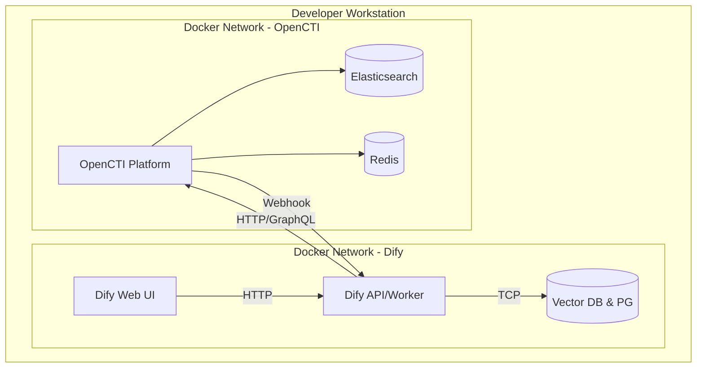

# AI4SEC系统技术和物理层架构

// @ArchitectureID: 1210

## 1. 文档定位与范围

本文档基于 ArchiMate 3.1 建模语言规范，针对“AI4SEC 系统”的物理与技术层进行单机开发环境的目标部署架构设计。

- **架构层级:** TechnologyLayer (1210)
- **部署形态:** 单机开发测试环境
- **上层依赖追溯:** 
  - StrategyLayerAndMotivationAspect (1207)
  - BusinessLayer (1208)
  - ApplicationLayer (1209)

## 2. 物理层架构 (Physical Layer)

在单机开发演练环境下，物理层聚焦于单一设备的资源划分，以及通过虚拟化承载的计算节点和对应的资源诉求。

### 2.1 物理节点拓扑 (Nodes & Devices)
- **Developer Workstation (Device):** 宿主机（例如个人 PC，Win/Mac/Linux），提供物理计算资源和基础执行环境。具有唯一的环回接口(`localhost`)。
- **Docker Host (Node):** 在工作站上运行的容器引擎底层虚拟机（如 Docker Desktop 虚拟节点），统筹系统硬件并分配给各个容器。
  - 核心物理网络 (Communication Network): `docker0` 桥接以及建立的多个跨容器应用子网 (如 `dify-network`, `opencti-network` )。
  - 持久化卷 (System Software Volume): 用于挂载数据库和知识沉淀等日志记录。

## 3. 技术层架构 (Technology Layer)

技术层核心展现系统软件及容器 (Containers) 的集成方式与执行逻辑，贯彻 Separation of Concerns（关注点分离）原则。我们将应用组件依据运行边界进行分解：

### 3.1 容器拓扑 (Container Environment)

核心组件被包装进特定的独立服务集群（由于部署方式限制为 Docker Compose，将各个镜像作为独立的 System Software / Container 定义）：

#### 3.1.1 核心情报底座 (OpenCTI)
位于 `opencti_network`。
- **OpenCTI Platform:** 提供 STIX 2.1 数据的持久化管理及 GraphQL 入口，并包含工作流推送Webhook。
- **关联支撑组件 (Dependencies):**
  - **Elasticsearch:** 全局文档索引与搜查服务 (容器集群端口: 9200)
  - **Redis:** 缓存和队列消息管理 (端口: 6379)
  - **MinIO/RabbitMQ:** (如包含) 用作对象存储和异步队列
  - **OpenCTI Connectors:** 根据价值流按需启动外部情报抓取连接器实例。

#### 3.1.2 统一智能与编排入口 (DIFY)
位于 `dify_network`。
- **Dify Core Services:**
  - **API Server:** 处理应用前台以及 Agent Webhook 调度。
  - **Worker Server:** 后台执行长时 AI Agent 工作流与大语言模型对接。
  - **Web Frontend:** 人机交换工作台 (映射到宿主机端口如 80/3000，供情报分析师等业务角色访问)。
- **持久化与检索 (Dependencies):**
  - PostgreSQL、Weaviate/Qdrant 向量数据库，缓存库等独立容器。

#### 3.1.3 当前运行时边界
截至 2026-03-19，仓库内不再部署独立 MCP Nodes。保留的 Dify Workflow 直接通过 HTTP 节点或代码节点访问 OpenCTI GraphQL；`mcp/opencti_mcp/` 与 `mcp/notification_mcp/` 仅保留退役后的兼容命名空间，不再构成可启动技术节点。

### 3.2 网络通讯与集成契约 (Communication Paths)

## 4. 特性声明与冲突对齐 (Alignment with Application Layer)

### 4.1 Progressive Disclosure (渐进式披露) 实现
- 技术实现方面，底层 DB、Elasticsearch、Redis 均不直接对 Dify 工作流暴露底层实现细节。当前保留工作流通过受控的 GraphQL 查询直接访问 OpenCTI，应用层不必感知 `dify_network` 到 `opencti_network` 间桥接路由跳数。

### 4.2 结构不变性原则
- 所有应用层所设定的核心业务对象映射 (STIX 2.1) 均被保证不会遭受底层数据库结构影响。即使 `OpenCTI` 在底层运用 `Elasticsearch` 进行存储查询，保留 Workflow 仍只消费标准 GraphQL Object 模型投影，而不直接依赖底层存储结构。

### 4.3 预埋可演进能力
- 考虑到应用层的 “价值流触发” 极度依赖 OpenCTI Webhook 以及外部 SIEM 告警（如 CI/CD pipeline 和告警数据），单机测试环境中要求 Dify API Gateway 需监听宿主机可内网穿透或可直接暴露的测试端口（如利用 Ngrok 或本地特权穿透桥）以便于联调。若后续需要恢复标准化通知或统一入口，应作为新的独立技术节点重新部署，而不是假设旧 MCP 服务仍存在。

## 5. 资源需求建议

针对以上物理与技术层单机部署，最低硬件配置建议（为保障流畅测试）：
- **CPU:** >= 8 Core (Dify及Elasticsearch运行较消耗计算池)
- **Memory:** >= 16 GB 
- **Storage:** 建议 50 GB 以上 NVMe SSD，以防频繁索引构建时遭遇 I/O 阻塞。