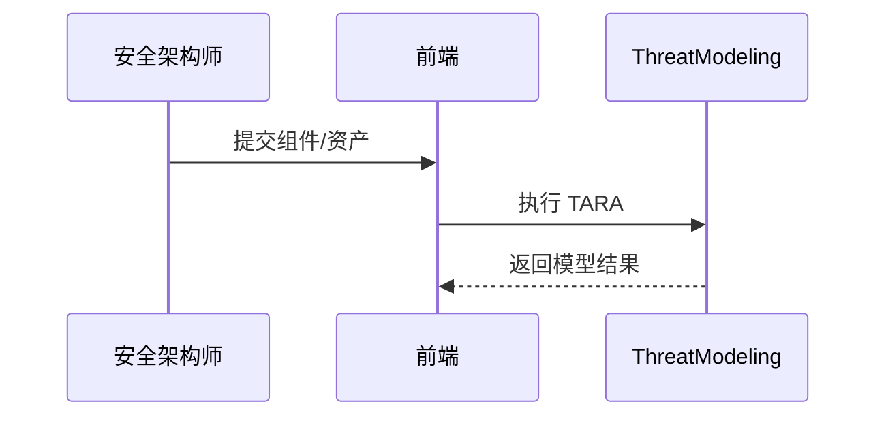

<!-- @ArchitectureID: 1088 -->

# BP 威胁建模（TARA 分析）

## 利益相关者
| 利益相关者 | 关注点 | 用户故事 |
|---|---|---|
| 安全架构师 | 威胁覆盖率 | 作为安全架构师，我希望在设计阶段自动生成威胁模型，以便提前定义安全目标。 |
| 产品负责人 | 整改优先级 | 作为产品负责人，我希望看到风险优先级与整改建议，以便合理排期。 |

## 场景1：新系统设计阶段执行 TARA
- 输入（STIX 2.1）：`sdo:Software(系统组件)` + `sdo:Identity(资产)` + 历史 `sdo:Incident`
- 输出（STIX 2.1）：`sdo:Attack-Pattern` + `sdo:Security-Goal` + `sdo:Course-of-Action`
- 业务价值：让“安全内建”落地到设计阶段。

### 验收标准（人工可测试）
1. 输入组件与资产后输出可解释 TTP 与安全目标。
2. 支持 `persist=true` 持久化并建立关系。
3. 可消费历史 Incident 作为建模上下文。

## 用户界面（Step-by-Step 基于当前 UI）
### 推荐的UX交互模式 (Recommended UX Interaction Pattern)
| 维度 | 建议 | 理由 |
|---|---|---|
| 输入方式 | 结构化表单 + JSON | 兼容不同用户熟练度 |
| 输出展示 | 风险分级表格 + 关系图 | 便于评审决策 |

### 主要操作流程
1. 输入组件、资产与架构描述。
2. 执行 TARA 分析。
3. 审阅并保存模型结果。

### 交互流程图

### SHOWCASE
- 输出：2 个 `sdo:Attack-Pattern` + 3 个 `sdo:Security-Goal`

