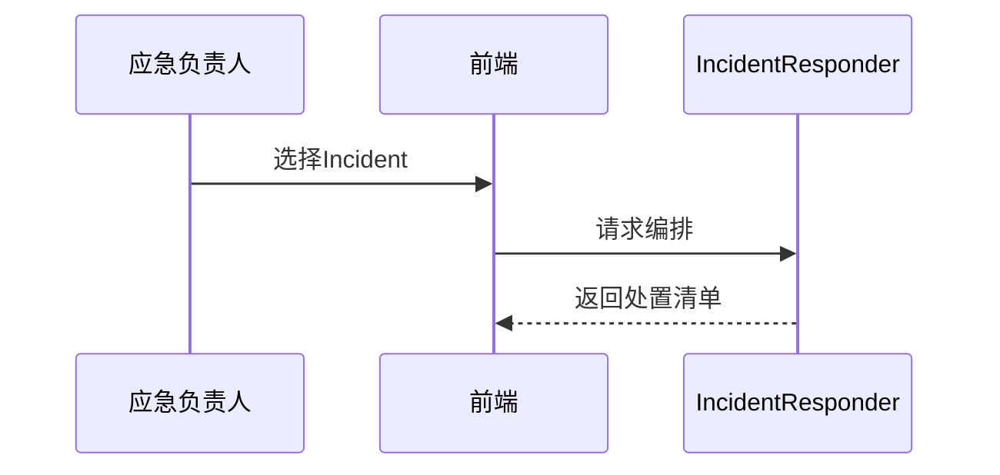

<!-- @ArchitectureID: 1088 -->

# BP 应急响应（编排处置）

## 利益相关者
| 利益相关者 | 关注点 | 用户故事 |
|---|---|---|
| 应急响应负责人 | MTTR | 作为响应负责人，我希望系统自动编排动作，以便缩短处置时间。 |
| SOC 经理 | 可审计性 | 作为 SOC 经理，我希望每次处置可追溯，以便用于复盘审计。 |

## 场景1：确认 Incident 后自动编排响应
- 输入：`sdo:Incident` + `sdo:Vulnerability` + `sdo:Attack-Pattern`
- 输出：`sdo:Course-of-Action` + `sdo:Report(IR报告)`
- 业务价值：缩短 MTTR，降低业务影响。

### 验收标准（人工可测试）
1. 传入 Incident 可生成分步处置计划。
2. 输出包含顺序、回滚建议、责任建议。
3. 可生成结构化 IR 报告。

## 用户界面（Step-by-Step 基于当前 UI）
### 推荐的UX交互模式 (Recommended UX Interaction Pattern)
| 维度 | 建议 | 理由 |
|---|---|---|
| 主界面 | Incident 卡片 + CoA 清单 + IR 预览 | 决策路径清晰 |
| 输出方式 | 时间线 + 报告导出 | 便于复盘审计 |

### 主要操作流程
1. 选择 Incident。
2. 自动编排处置。
3. 审核并执行。

### 交互流程图

### SHOWCASE
- 输出：5 条 `sdo:Course-of-Action` + 1 份 `sdo:Report`

