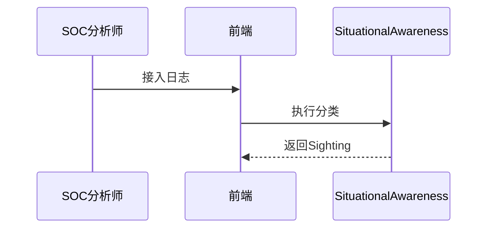

<!-- @ArchitectureID: 1088 -->

# BP 态势感知（日志聚合与监控 / 威胁研判自动化分类）

## 利益相关者
| 利益相关者 | 关注点 | 用户故事 |
|---|---|---|
| SOC 分析师 | 告警降噪 | 作为 SOC 分析师，我希望自动分类可疑行为，以便快速定位高风险事件。 |
| 运营经理 | 闭环效率 | 作为运营经理，我希望高风险结果可直接进入响应流程。 |

## 场景1：多源观测数据自动生成可疑迹象
- 输入：`sdo:Observed-Data` + `sdo:Network-Traffic` + `sdo:Indicator`
- 输出：`sdo:Sighting` + `sdo:Incident`
- 业务价值：提升研判效率。

### 验收标准（人工可测试）
1. 日志/流量导入后生成结构化 Sighting。
2. 结合 Indicator 提升优先级准确度。
3. 支持升级高风险项为 Incident。

## 用户界面（Step-by-Step 基于当前 UI）
### 推荐的UX交互模式 (Recommended UX Interaction Pattern)
| 维度 | 建议 | 理由 |
|---|---|---|
| 输入方式 | 日志流接入 + 文件上传 | 兼容在线与离线 |
| 输出展示 | 告警列表 + 详情侧栏 | 便于快速处理 |

### 主要操作流程
1. 接入日志流。
2. 执行分类。
3. 升级并保存高风险结果。

### 交互流程图

### SHOWCASE
- 输出：12 个 `sdo:Sighting`，其中 2 个升级为 `sdo:Incident`

