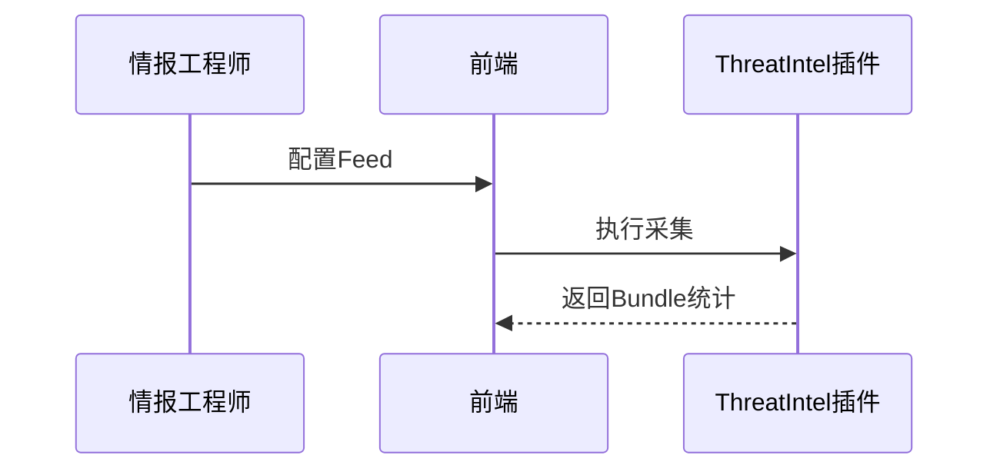

<!-- @ArchitectureID: 1088 -->

# BP 情报摄取（多源采集）

## 利益相关者
| 利益相关者 | 关注点 | 用户故事 |
|---|---|---|
| 情报工程师 | 情报新鲜度 | 作为情报工程师，我希望自动采集多源情报，以便持续补充检测燃料。 |
| SOC 团队 | 情报可用性 | 作为 SOC 团队，我希望情报自动转 STIX 入库。 |

## 场景1：定时采集外部情报源并入库
- 输入：`sdo:Report(外部Feed)` + `sdo:Identity(外部组织)`
- 输出：`sdo:Bundle` + `sdo:Indicator` + `sdo:Vulnerability`
- 业务价值：降低人工采集成本。

### 验收标准（人工可测试）
1. 支持多个 Feed 按计划采集。
2. 生成 Bundle 并记录统计。
3. IoC/CVE 可结构化写入图谱。

## 用户界面（Step-by-Step 基于当前 UI）
### 推荐的UX交互模式 (Recommended UX Interaction Pattern)
| 维度 | 建议 | 理由 |
|---|---|---|
| 源配置 | Feed 列表 + 启停开关 | 快速运维 |
| 执行监控 | 任务历史统计 | 提升可观测性 |

### 主要操作流程
1. 配置 Feed。
2. 触发采集。
3. 查看并保存结果。

### 交互流程图

### SHOWCASE
- 输出：1 个 `sdo:Bundle` + 18 个 `sdo:Indicator`

