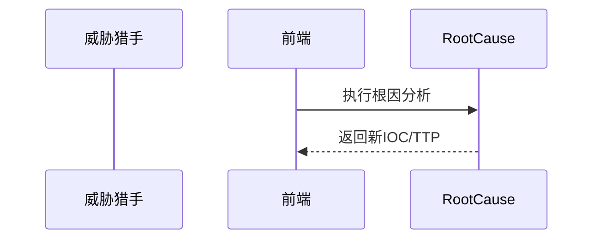

<!-- @ArchitectureID: 1088 -->

# BP 根因分析（溯源复盘）

## 利益相关者
| 利益相关者 | 关注点 | 用户故事 |
|---|---|---|
| 威胁猎手 | 新 IOC/TTP 提炼效率 | 作为威胁猎手，我希望从事件证据中提炼新特征。 |
| 安全架构师 | 设计反馈闭环 | 作为架构师，我希望复盘结果反哺设计模型。 |

## 场景1：处置完成后进行复盘与知识回灌
- 输入：`sdo:Incident` + 取证数据
- 输出：`sdo:Indicator` + `sdo:Attack-Pattern` + `sdo:Course-of-Action`
- 业务价值：将事件经验沉淀为防御能力。

### 验收标准（人工可测试）
1. 可提炼结构化 Indicator 与 Attack-Pattern。
2. 新对象可回流态势感知与威胁建模。
3. 支持 Design Miss 标记并生成设计更新建议。

## 用户界面（Step-by-Step 基于当前 UI）
### 推荐的UX交互模式 (Recommended UX Interaction Pattern)
| 维度 | 建议 | 理由 |
|---|---|---|
| 输入方式 | Incident 选择 + 证据上传 | 启动成本低 |
| 输出展示 | 新 IOC/TTP 卡片 + 关系图 | 便于回灌确认 |

### 主要操作流程
1. 选择 Incident。
2. 上传证据执行复盘。
3. 审核并保存回灌。

### 交互流程图

### SHOWCASE
- 输出：2 个新 `sdo:Indicator` + 1 个新 `sdo:Attack-Pattern`

