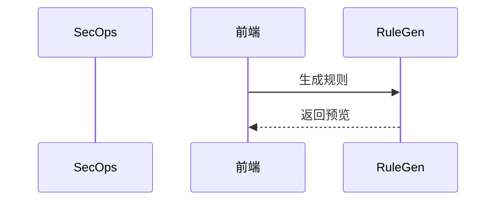

<!-- @ArchitectureID: 1088 -->

# BP 检测规则自动化生成

## 利益相关者
| 利益相关者 | 关注点 | 用户故事 |
|---|---|---|
| SecOps 工程师 | 规则生成速度 | 作为 SecOps 工程师，我希望从威胁模型自动生成规则。 |
| SOC 经理 | 规则质量 | 作为 SOC 经理，我希望规则带有上下文增强可用性。 |

## 场景1：从 TARA 输出自动生成 Sigma/SPL 规则
- 输入：`sdo:Attack-Pattern` + `sdo:Software` + `sdo:Security-Goal`
- 输出：`sdo:Indicator` + `sdo:Report(规则生成报告)`

### 验收标准（人工可测试）
1. 解析输入并映射规则模板。
2. 输出包含资产与风险上下文。
3. 可发布至规则库。

## 用户界面（Step-by-Step 基于当前 UI）
### 推荐的UX交互模式 (Recommended UX Interaction Pattern)
| 维度 | 建议 | 理由 |
|---|---|---|
| 输入方式 | 模板选择 + Threat Model 绑定 | 减少手工编写 |
| 输出展示 | 规则预览 + 差异对比 | 便于审核 |

### 主要操作流程
1. 选择 Threat Model。
2. 生成并审核规则。
3. 发布规则。

### 交互流程图

### SHOWCASE
- 输出：1 条 Sigma 规则 + 1 份生成报告。

