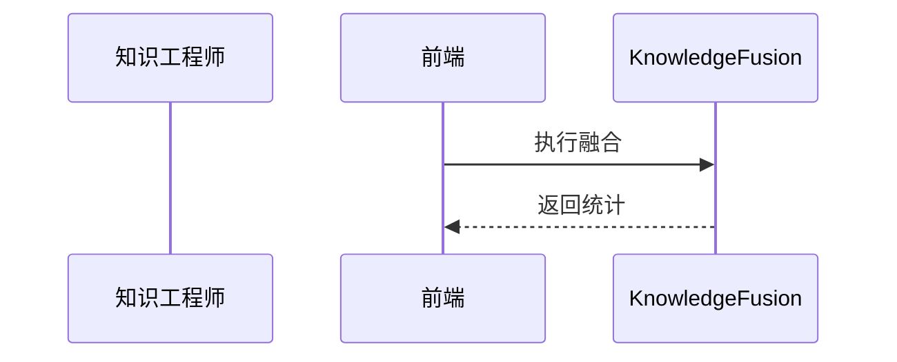

<!-- @ArchitectureID: 1088 -->

# BP 情报研判（影响关联分析）

## 利益相关者
| 利益相关者 | 关注点 | 用户故事 |
|---|---|---|
| 知识工程师 | 实体对齐 | 作为知识工程师，我希望外部情报漏洞与内部资产自动关联并去重。 |
| 分析师 | 影响可解释 | 作为分析师，我希望看到“外部漏洞如何影响内部系统”的完整链路。 |

## 场景1：多源 STIX 对象关联研判建图
- 输入：`sdo:Bundle` + `sdo:Indicator` + `sdo:Vulnerability`
- 输出：`sdo:Relationship` 网络 + `sdo:Report`

### 验收标准（人工可测试）
1. 支持外部情报与内部资产的关联去重。
2. 自动补全关键关系并给出影响路径。
3. 输出研判统计与影响说明。

## 用户界面（Step-by-Step 基于当前 UI）
### 推荐的UX交互模式 (Recommended UX Interaction Pattern)
| 维度 | 建议 | 理由 |
|---|---|---|
| 输入方式 | Bundle 导入 + 资产范围配置 | 支持批处理与影响面限定 |
| 输出展示 | 关系图 + 影响说明 + 冲突列表 | 便于研判和校正 |

### 主要操作流程
1. 导入 Bundle。
2. 配置策略并执行融合。
3. 审阅并保存结果。

### 交互流程图

### SHOWCASE
- 输出：合并对象与新增关系统计。

