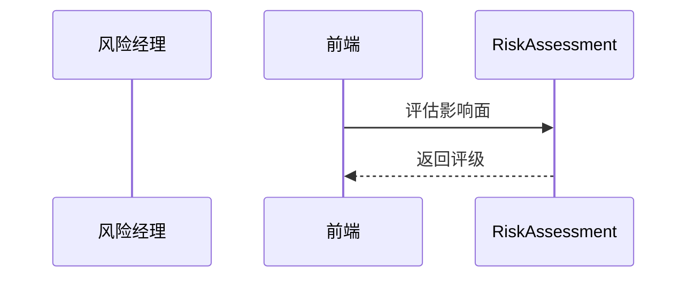

<!-- @ArchitectureID: 1088 -->

# BP 风险预警（影响面评估）

## 利益相关者
| 利益相关者 | 关注点 | 用户故事 |
|---|---|---|
| 风险运营经理 | 预警准确率 | 作为风险运营经理，我希望自动评估漏洞影响面。 |
| 系统负责人 | 受影响资产范围 | 作为系统负责人，我希望明确修复优先级。 |

## 场景1：新漏洞出现后自动评估影响面
- 输入：`sdo:Vulnerability` + `sdo:Software(内部SBOM)` + `sdo:Identity(资产)`
- 输出：`sdo:Incident` + `sdo:Report(风险评级)`

### 验收标准（人工可测试）
1. 输出受影响资产清单。
2. 给出风险评级。
3. 高风险项可升级 Incident。

## 用户界面（Step-by-Step 基于当前 UI）
### 推荐的UX交互模式 (Recommended UX Interaction Pattern)
| 维度 | 建议 | 理由 |
|---|---|---|
| 输入方式 | CVE 输入 + 资产范围选择 | 提升精度 |
| 输出展示 | 影响面列表 + 热力图 | 便于优先处置 |

### 主要操作流程
1. 输入 CVE。
2. 执行评估。
3. 升级高风险项。

### 交互流程图

### SHOWCASE
- 输出：1 个 `sdo:Incident` + 1 份 `sdo:Report`。

