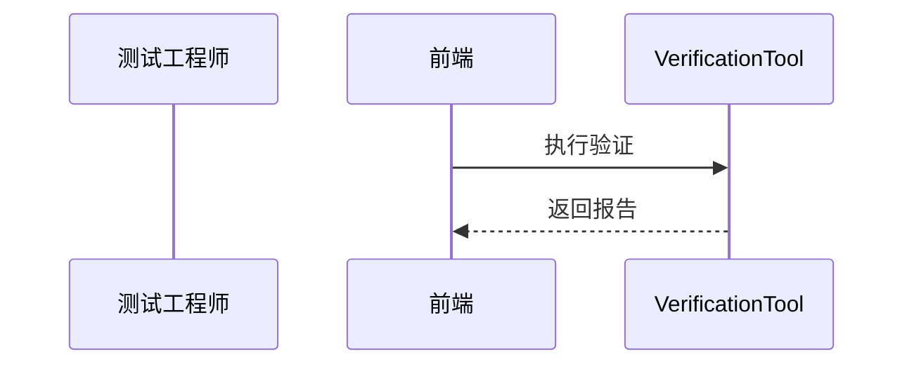

<!-- @ArchitectureID: 1088 -->

# BP 验证与修复（自动化测试与修复）

## 利益相关者
| 利益相关者 | 关注点 | 用户故事 |
|---|---|---|
| 测试工程师 | 回归效率 | 作为测试工程师，我希望自动验证修复有效性。 |
| 研发负责人 | 发布质量 | 作为研发负责人，我希望修复后自动回归并生成报告。 |

## 场景1：漏洞修复后自动验证与回归
- 输入：`sdo:Vulnerability` + `sdo:Course-of-Action` + `sdo:Software(测试版本)`
- 输出：`sdo:Report(测试报告)` + `sdo:Opinion(风险评级)`

### 验收标准（人工可测试）
1. 自动生成并执行验证任务。
2. 报告包含通过率与失败项。
3. 失败可回流修复流程。

## 用户界面（Step-by-Step 基于当前 UI）
### 推荐的UX交互模式 (Recommended UX Interaction Pattern)
| 维度 | 建议 | 理由 |
|---|---|---|
| 输入方式 | 选择漏洞 + 修复方案 + 版本 | 信息完整 |
| 输出展示 | 测试报告 + 风险变化趋势 | 支持发布决策 |

### 主要操作流程
1. 选择待验证漏洞。
2. 执行自动回归。
3. 查看报告并回流失败项。

### 交互流程图

### SHOWCASE
- 输出：`sdo:Report`（通过率 92%）+ 风险从 High 降到 Medium。

