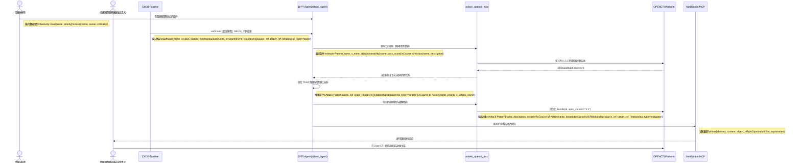

# VS1-E2E 威胁建模端到端用户故事

> 前置依赖约定：本用户故事默认继承并遵循 [00_通用架构约束与工具规范.md](./00_通用架构约束与工具规范.md) 中关于 DIFY Agent、OPENCTI、Notification MCP 与 STIX 2.1 的统一约束。

## 1、概要

本故事面向情报分析师与研发安全负责人，描述在持续交付过程中，如何借助 DIFY Agent 调度 OPENCTI 与相关 MCP 组件，把架构变更、依赖变化和历史威胁情报自动汇聚为新的威胁模型，并形成可发布判定。输出必须以 STIX 2.1 对象形式沉淀，供后续验证、审计和发布阻断复用。

## 2、执行全景图 (DIFY & OPENCTI 协作流)

## 3、故事：支付域新版本上线前的威胁建模闭环

### 第一幕：情报分析师定义建模边界

情报分析师为支付域 `v2.8.0` 上线建立一次新的建模任务，在 DIFY Agent 中录入核心业务目标、关键资产、外部暴露面和必须满足的安全目标。此时系统形成首批可计算输入，包括 `Software{name="payment-gateway", version="2.8.0"}`、`Infrastructure{name="prod-payment-cluster", environment="prod"}` 和 `Identity{name="payments-team", role="service-owner"}`。

### 第二幕：DIFY Agent 拉起 OPENCTI 上下文

CI/CD 流水线推送架构图、代码变更和依赖清单后，DIFY Agent 通过 `ai4sec_opencti_mcp` 向 OPENCTI 查询与支付网关相关的 `Attack-Pattern`、`Vulnerability` 和 `Course-of-Action`。OPENCTI 返回包含历史攻击模式、已知依赖漏洞、既有缓解手段及其 `Relationship` 的 STIX Bundle，供 Agent 在当前版本上下文中复用。

### 第三幕：系统生成新威胁模型并阻断高风险发布

DIFY Agent 将当前变更与历史图谱叠加，输出新的 `Attack-Pattern`、`Course-of-Action` 和 `Relationship(Attack-Pattern mitigated-by Course-of-Action)`，并形成 `Opinion{opinion="strongly-disagree"}` 类型的不可发布结论。Notification MCP 把整改建议同步给研发安全负责人，后者再进入 OPENCTI 查看完整证据链，确认哪些威胁仍未被有效覆盖。
