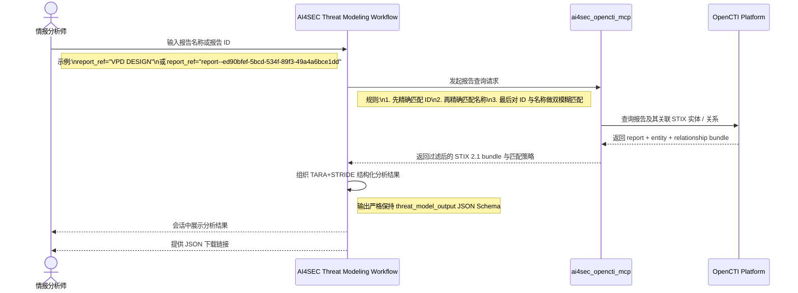

# VS1-E2E 报告驱动威胁建模 Workflow 用户故事

> 前置依赖约定：本用户故事默认继承并遵循 [00_通用架构约束与工具规范.md](./00_通用架构约束与工具规范.md) 中关于 DIFY Agent、OPENCTI、Notification MCP 与 STIX 2.1 的统一约束。

## 1、概要

本故事面向情报分析师，描述一个独立的 VS1 Threat Modeling Workflow 如何围绕报告名称或报告 ID 完成威胁建模闭环。用户先在会话中输入报告标识，系统按“精确匹配优先、失败后双模糊匹配”的规则在内部 OpenCTI 中定位报告，再通过 `ai4sec_opencti_mcp` 拉取与该报告关联的 STIX 2.1 实体和关系，过滤掉与威胁分析无关的字段后，组织为固定 JSON Schema 的威胁建模结果，并在会话中展示与提供 JSON 下载入口。该独立 Workflow 不负责把分析结果写回 OpenCTI，也不接入 Notification MCP 的完整通知分支。

## 2、执行全景图 (独立 Workflow & OPENCTI 协作流)

## 3、故事：情报分析师基于报告快速发起一次独立威胁建模

### 第一幕：用户输入报告标识而不是底层对象查询语句

情报分析师在独立的 VS1 Threat Modeling Workflow 中直接输入 `vs1-payment-threat-model` 或者 OpenCTI 中的 `report--...` 报告 ID。Workflow 不要求用户理解底层 GraphQL 或对象引用细节，只接受业务侧最自然的报告标识输入。

### 第二幕：MCP 负责报告定位与字段过滤

Workflow 将用户输入交给 `ai4sec_opencti_mcp`。MCP 首先尝试按报告 ID 和报告名称做精确匹配；如果都失败，再对名称和 ID 同时执行模糊匹配并选择最佳候选。定位到报告后，MCP 只返回对威胁建模有帮助的 STIX 2.1 字段，例如 `report`、`software`、`infrastructure`、`identity`、`attack-pattern`、`course-of-action` 与 `relationship`，避免把 `x_opencti_*` 等实现噪声带入后续分析。

### 第三幕：Workflow 输出结构化分析并提供下载

独立 Workflow 基于过滤后的 bundle 组织固定的 `TARA+STRIDE` JSON 结果，在会话中展示攻击模式、目标资产、缓解动作和风险摘要，同时直接生成 JSON 下载链接。分析结果仅作为当前会话的输出资产，不回写 OpenCTI，也不额外触发 Notification MCP 的完整通知链路。