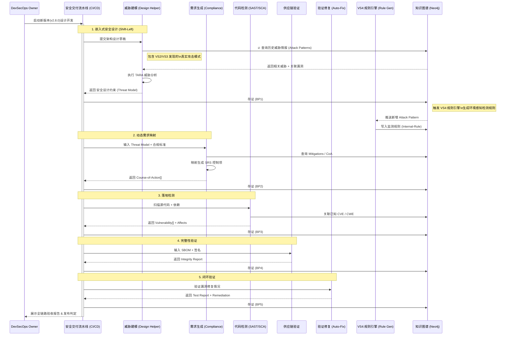

# VS1-E2E 持续安全交付闭环（端到端用户故事）

## 价值流视角
- 价值流：价值流 1：持续安全交付闭环

## 用户故事（跨流程）
- 作为：研发安全负责人（DevSecOps Owner）
- 我希望：系统从"威胁建模→验证修复"形成自动化闭环
- 以便：每次版本交付都具备可证明的安全基线与修复验证

## 验收标准
1. 同一版本在闭环中具有统一追踪ID（可串联全部环节产物）。
2. 输出完整链路证据：`Attack-Pattern`、`测试报告/修复方案`。
3. 任一环节失败可阻断发布并给出可执行整改项。
4. 最终生成“可发布判定”与“残余风险说明”。

## SHOWCASE（端到端）
### 场景
支付系统 `v2.8.0` 准备上线，要求在 24 小时内完成全链路安全验证。

### 输入
- 系统组件与资产清单
- 合规条款文档
- 代码仓与依赖清单

### 执行链路
1. TARA 输出关键威胁与安全目标。
2. 自动化验证通过修复，生成整改建议。

### 输出
- 发布判定：`Pass/Blocked`
- 证据包：威胁模型、测试报告、修复建议

### 业务价值
- 把“安全检查”变成“可追溯交付标准”，减少带病上线与返工。

## 已验证的实现展示 (Verified End-to-End Implementation)

### 用户交互流程
1. **BP - 威胁建模 TARA 分析:** 用户输入系统架构，系统生成 `sdo:Attack-Pattern[]` 与 `sdo:Identity[]` 关系

### 端到端数据流
```
输入 (Attack-Pattern, SRS@要求, 源代码, 依赖, 构建产物)
  ↓
BP1 (threat_model) → sdo:Attack-Pattern[], sdo:Identity[], sdo:Relationship(threatens)
  ↓
输出 (可发布判定 + 完整审计链)
```

### 关键指标
- **链路追踪ID:** 唯一 Bundle ID 串联全部环节
- **发布禁令:** 存在高危未闭环时自动阻断
- **残余风险:** 已识别但暂未修复的漏洞等级与数量

## 推荐的UX交互模式 (Recommended UX Interaction Pattern)
| 维度 | 建议 | 理由 |
|------|------|------|
| **整体视图** | **管道/流水线图 (Pipeline Visualization)** | 展示5个BP的串联流程，支持查看各阶段的中间产物 |
| **导航方式** | 点击管道中的任一阶段进入BP详情 | 支持快速跳转到特定阶段 |
| **追踪ID** | 显示贯穿全链的Bundle/Trace ID | 用户可追踪一个版本的完整安全审计链 |
| **输出展示** | **最终仪表板** | 显示"发布判定" (Pass/Blocked) 与完整证据包链接 |
| **关键指标** | 显示高危未闭环漏洞数、测试覆盖率等 | 一眼看出风险与交付状态 |

### 交互流程图 (Interaction Diagram)


