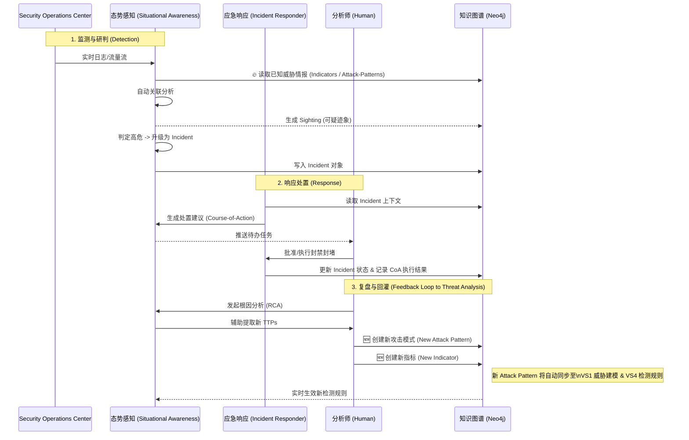

# VS2-E2E 威胁运营与响应闭环（端到端用户故事）

## 价值流视角
- 价值流：价值流 2：威胁运营与响应闭环
- 串联 Business Process：
  1. [BP 态势感知 日志聚合与监控_威胁研判自动化分类](../business_processes/BP_态势感知_日志聚合与监控_威胁研判自动化分类.md)
  2. [BP 应急响应 编排处置](../business_processes/BP_应急响应_编排处置.md)
  3. [BP 根因分析 溯源复盘](../business_processes/BP_根因分析_溯源复盘.md)

## 用户故事（跨流程）
- 作为：SOC 经理
- 我希望：系统从“发现可疑→确认事件→自动处置→复盘回灌”自动闭环
- 以便：持续降低 MTTD/MTTR 并提升检测能力

## 验收标准
1. 从 `Observed-Data/Network-Traffic` 可生成 `Incident` 并触发处置。
2. 处置阶段输出 `Course-of-Action` 与 IR 报告。
3. 复盘阶段产出新 `Indicator`/`Attack-Pattern` 并回灌检测环节。
4. 可量化闭环指标：告警到处置耗时、处置成功率、回灌命中率。

## SHOWCASE（端到端）
### 场景
凌晨出现可疑横向移动，值班团队需在 30 分钟内完成遏制与初步复盘。

### 输入
- SIEM 日志与流量快照
- 外部威胁指标（Indicator）

### 执行链路
1. 自动分类识别高危 Sighting，并升级为 Incident。
2. 编排执行隔离主机、封禁 IOC、收集取证。
3. 输出 IR 报告与时间线。
4. 复盘提炼出 2 个新 IOC 与 1 条 TTP，回灌检测策略。

### 输出
- 处置状态：`Contained`
- 回灌状态：`Enabled`
- 关键指标：MTTD 下降、MTTR 下降

### 业务价值
- 从“单次救火”升级为“能力增长型运营”，事件越多检测越强。
## 推荐的UX交互模式 (Recommended UX Interaction Pattern)
| 维度 | 建议 | 理由 |
|------|------|------|
| **整体视图** | **事件生命周期看板 (Incident Lifecycle Board)** | 展示事件从发现→处置→复盘的全过程 |
| **看板模式** | 卡片墙风格：检测中 → 确认中 → 处置中 → 已闭环 | 支持拖拽卡片推进阶段 |
| **关键指标** | 展示MTTD、MTTR、处置成功率等 | 量化运营效能 |
| **复盘反馈** | 显示本周回灌的新IOC/TTP数量 | 体现"越响应越强"的知识增长 |

### 交互流程图 (Interaction Diagram)
