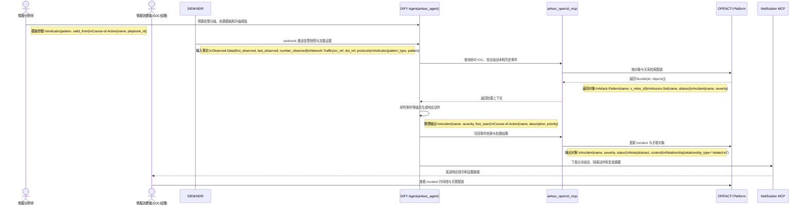

# VS2-E2E 威胁运营与响应闭环端到端用户故事

> 前置依赖约定：本用户故事默认继承并遵循 [00_通用架构约束与工具规范.md](./00_通用架构约束与工具规范.md) 中关于 DIFY Agent、OPENCTI、Notification MCP 与 STIX 2.1 的统一约束。

## 1、概要

本故事面向情报分析师与 SOC 经理，描述告警进入系统后，DIFY Agent 如何编排 OPENCTI、处置知识和通知链路，将原始观测升级为可执行的事件响应闭环。核心目标是把处置过程中的每一步都固化为 STIX 对象与关系，确保后续复盘、二次检索和规则回灌都能复用。

## 2、执行全景图 (DIFY & OPENCTI 协作流)

## 3、故事：横向移动告警的运营与响应闭环

### 第一幕：告警快照进入 DIFY Agent

深夜时段，SIEM 检测到来自办公网段到生产跳板机的异常横向移动尝试，并通过 webhook 将 `Observed-Data{number_observed=17}`、`Network-Traffic{src_ref="host-A", dst_ref="bastion-01", protocols=["smb"]}` 和命中的 `Indicator{pattern="[ipv4-addr:value = '10.1.2.7']"}` 一并推送给 DIFY Agent。

### 第二幕：OPENCTI 提供事件上下文与可执行处置

DIFY Agent 通过 `ai4sec_opencti_mcp` 检索与该 IOC 相关的 `Attack-Pattern`、`Intrusion-Set` 和既有 `Incident`，发现该模式与一次历史横向移动活动高度相似。Agent 随即结合预置剧本生成新的 `Course-of-Action`，包括隔离主机、封禁 IOC、抓取关键内存证据和冻结高风险账号。

### 第三幕：SOC 经理接收结果并闭环回灌

系统把新建的 `Incident{name="possible-lateral-movement"}`、处置 `Note` 和相关 `Relationship` 写入 OPENCTI，再由 Notification MCP 把“已隔离、待复核、需复盘”的行动摘要同步给 SOC 经理。SOC 经理在 OPENCTI 中核查完整时间线，确认新产生的 IOC 是否需要转化为新的 `Indicator` 以回灌检测链路。
