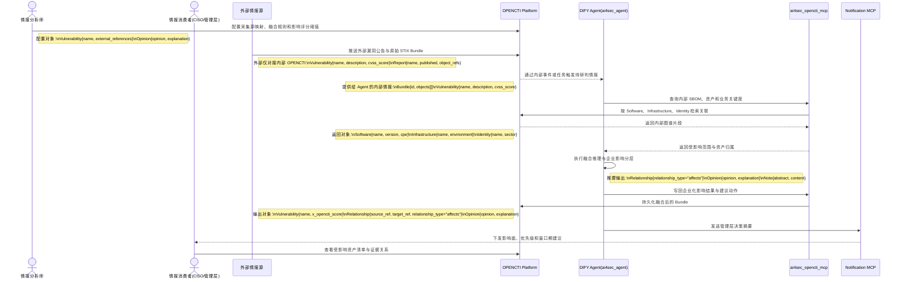

# VS3-E2E 动态知识进化闭环端到端用户故事

> 前置依赖约定：本用户故事默认继承并遵循 [00_通用架构约束与工具规范.md](./00_通用架构约束与工具规范.md) 中关于 DIFY Agent、OPENCTI、Notification MCP 与 STIX 2.1 的统一约束。

## 1、概要

本故事面向情报分析师与管理层情报消费者，描述在重大外部漏洞或零日事件出现后，系统如何先将外部情报统一接入内部 OPENCTI，再由 DIFY Agent 仅从内部 OPENCTI 拉取标准化 STIX 情报与内部资产图谱进行融合，生成对企业有意义的影响范围、优先级和决策建议。这里的关键不是“外部平台直接驱动 Agent”，而是由 OPENCTI 作为唯一内部情报底座，把外部 `Vulnerability` 进化为企业内部可执行的 `Opinion`、`Note` 和关系图谱。

## 2、执行全景图 (DIFY & OPENCTI 协作流)

## 3、故事：外部零日被快速转化为管理层可执行结论

### 第一幕：情报分析师启动外部情报融合

外部情报源推送一条新的高危零日公告，但该情报并不直接进入 DIFY Agent，而是先通过既定对接方式进入内部 OPENCTI。情报分析师预先在 OPENCTI 侧定义了采集源映射、评分阈值和融合规则，因此系统先沉淀 `Vulnerability{name="CVE-2026-XXXX", cvss_score=9.8}` 与 `Report{name="0day-advisory", published="2026-03-13T08:00:00Z"}` 等对象，再由内部流程将待研判情报提供给 Agent。

### 第二幕：DIFY Agent 将外部漏洞映射到内部资产图谱

DIFY Agent 只通过 `ai4sec_opencti_mcp` 从内部 OPENCTI 拉取标准化后的 `Vulnerability`、`Report` 以及内部 `Software`、`Infrastructure` 和 `Identity` 关系，识别哪些生产系统、业务负责人和外网暴露资产正在使用受影响组件。随后 Agent 把从 OPENCTI 获取的漏洞对象与内部资产图谱融合，生成新的 `Relationship{relationship_type="affects"}`，并补充 `Opinion` 说明为什么该漏洞在企业语境下需要被提升优先级。

### 第三幕：管理层收到可决策的摘要而不是原始噪声

系统把融合后的 `Vulnerability`、`Opinion` 和 `Note` 写入 OPENCTI，并通过 Notification MCP 直接发送给 CISO 和相关管理者。收到的不是原始 CVE，而是“受影响资产有哪些、业务窗口期多久、优先修补哪些系统、哪些系统先做隔离”的企业级结论，管理层可以直接进入 OPENCTI 核验对象关系与影响证据。
