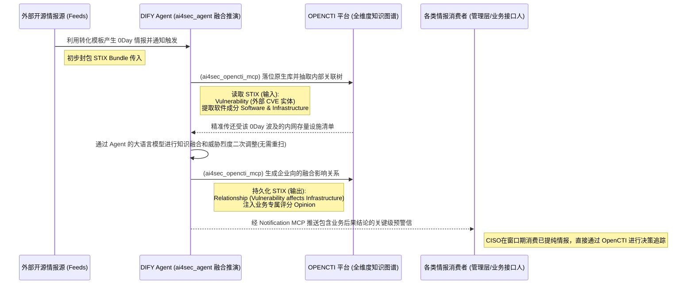

# VS3-E2E 动态知识进化闭环（端到端用户故事）

> **前置依赖约定**：本用户故事默认继承并遵循 [00_通用架构约束与工具规范.md](./00_通用架构约束与工具规范.md) 中关于 DIFY Agent 与 OPENCTI 平台的核心操作模式，以及 STIX 2.1 与 Notification 的强制架构准则。

## 价值流视角
- 价值流：价值流 3：动态知识进化闭环

## 用户故事（跨流程）
- 作为：各类情报消费者（CISO/管理人员等）及情报分析师
- 我希望：当外部爆发重大零日漏洞时，能利用情报分析师的基线规则对重大外部事件执行靶向解析转换为内部高价值的资产危害通告
- 以便：情报消费者能在事件窗口期精准消费该高质量业务情报并一键完成隔离和修补决策
## 验收标准
1. 支持定时采集外部零日情报并形成 `Bundle`。
2. `Bundle` 可与内部 SBOM/资产图谱自动融合，形成 `affects/targets/uses` 关系。
3. 在无需全量重扫条件下输出受影响资产清单、风险等级（Opinion）与处置建议（Note）。
4. 支持管理层视角的快速决策摘要（15 分钟内可用）。
## SHOWCASE（端到端）
### 场景
外部披露高危零日（如组件 RCE），管理层要求 15 分钟内给出影响面
### 输入
- 外部公告与情报Feed
- 内部 SBOM、资产图谱、业务关键级
### 执行链路
1. 多源采集生成原始情报包
2. 图谱融合定位受影响组件和系统
3. 风险评估输出高/中/低分层资产清单与应对优先级
### 输出
- `Opinion`：总体风险等级（如 High）
- `Note`：建议动作（隔离、补丁、监控增强）
- `Vulnerability affects Asset` 关系清单
### 业务价值
- 在无需全量扫描情况下快速给出受影响资产与决策依据

## 已验证的实现展示 (Verified End-to-End Implementation)
### 用户交互流程
1. **BP - 情报摄取:** 填写外部情报源，系统采集并生成 Bundle
2. **BP - 知识融合:** 输入 Bundle + 内部 SBOM，生成 enriched Vulnerability + affects 关系
3. **BP - 风险预警:** 输入 enriched Vulnerability，系统输出 Opinion(风险等级) + Note(建议)
### 后端流程
- **BP - 情报摄取:** threat_intel.ingest_external_intel() -> Bundle
- **BP - 知识融合:** knowledge_fusion.fuse_bundle_with_sbom() -> enriched Vulns
- **BP - 风险预警:** risk_assessment.assess_impact() -> Opinion+Note
### 关键指标
- **采集频率:** 每小时/每日自动采集外部源
- **融合准确率:** 匹配成功资产/漏洞关系数
- **业务影响:** 零日漏洞影响系统可追溯

### 交互流程图 (Interaction Diagram)

