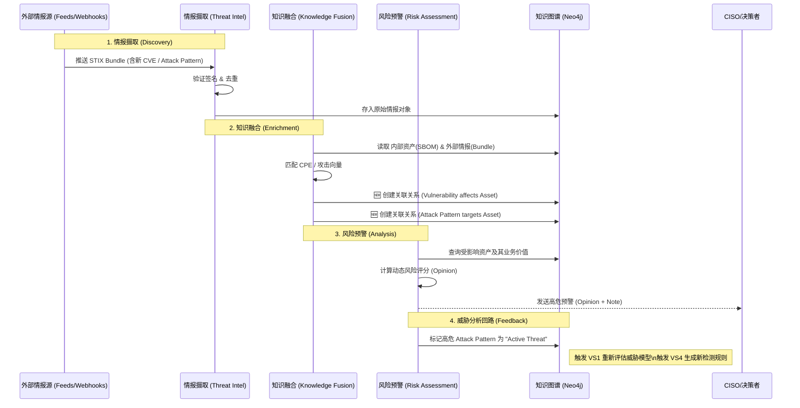

# VS3-E2E 动态知识进化闭环（端到端用户故事）
## 价值流视角
- 价值流：价值流 3：动态知识进化闭环
- 串联 Business Process：
  1. [BP 情报摄取 多源采集](../business_processes/BP_情报摄取_多源采集.md)
  2. [BP 知识融合 图谱构建](../business_processes/BP_知识融合_图谱构建.md)
  3. [BP 风险预警 影响面评估](../business_processes/BP_风险预警_影响面评估.md)
## 用户故事（跨流程）
- 作为：CISO
- 我希望：当外部爆发重大零日漏洞时，系统能把外部情报快速转化为内部影响面与处置建议，并在无需重新扫描的情况下给出受影响资产
- 以便：在重大漏洞窗口期内完成业务级决策，立刻决定是否隔离业务或紧急修补
## 验收标准
1. 支持定时采集外部零日情报并形成 `Bundle`。
2. `Bundle` 可与内部 SBOM/资产图谱自动融合，形成 `affects/targets/uses` 关系。
3. 在无需全量重扫条件下输出受影响资产清单、风险等级（Opinion）与处置建议（Note）。
4. 支持管理层视角的快速决策摘要（15 分钟内可用）。
## SHOWCASE（端到端）
### 场景
外部披露高危零日（如组件 RCE），管理层要求 15 分钟内给出影响面
### 输入
- 外部公告与情报Feed
- 内部 SBOM、资产图谱、业务关键级
### 执行链路
1. 多源采集生成原始情报包
2. 图谱融合定位受影响组件和系统
3. 风险评估输出高/中/低分层资产清单与应对优先级
### 输出
- `Opinion`：总体风险等级（如 High）
- `Note`：建议动作（隔离、补丁、监控增强）
- `Vulnerability affects Asset` 关系清单
### 业务价值
- 在无需全量扫描情况下快速给出受影响资产与决策依据

## 已验证的实现展示 (Verified End-to-End Implementation)
### 用户交互流程
1. **BP - 情报摄取:** 填写外部情报源，系统采集并生成 Bundle
2. **BP - 知识融合:** 输入 Bundle + 内部 SBOM，生成 enriched Vulnerability + affects 关系
3. **BP - 风险预警:** 输入 enriched Vulnerability，系统输出 Opinion(风险等级) + Note(建议)
### 后端流程
- **BP - 情报摄取:** threat_intel.ingest_external_intel() -> Bundle
- **BP - 知识融合:** knowledge_fusion.fuse_bundle_with_sbom() -> enriched Vulns
- **BP - 风险预警:** risk_assessment.assess_impact() -> Opinion+Note
### 关键指标
- **采集频率:** 每小时/每日自动采集外部源
- **融合准确率:** 匹配成功资产/漏洞关系数
- **业务影响:** 零日漏洞影响系统可追溯

## 推荐的UX交互模式 (Recommended UX Interaction Pattern)
| 维度 | 建议 | 理由 |
|------|------|------|
| **整体视图** | **知识演进时间线 (Knowledge Evolution Timeline)** | 展示外部情报输入 → 融合 → 风险评估的完整过程 |
| **数据流可视化** | 展示数周/数月的知识积累（新IOC/TTP增量、覆盖资产增量） | 体现"情报越多防控越强"的价值 |
| **ROI展示** | 对标零日漏洞的快速响应案例 | 量化知识融合的业务价值 |

### 交互流程图 (Interaction Diagram)

