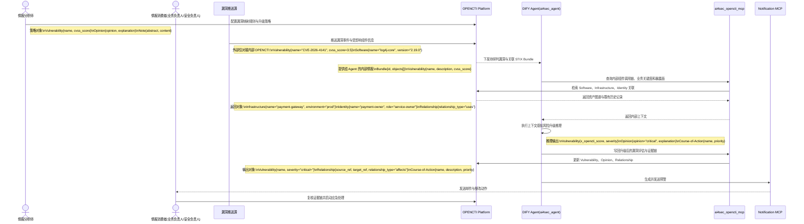

# VS3-E2E 漏洞风险评估与预警用户故事

> 前置依赖约定：本用户故事默认继承并遵循 [00_通用架构约束与工具规范.md](./00_通用架构约束与工具规范.md) 中关于 DIFY Agent、OPENCTI、Notification MCP 与 STIX 2.1 的统一约束。

## 1、概要

本故事面向情报分析师、业务负责人和安全负责人，描述一个外部评级并不高的漏洞，如何先被统一接入内部 OPENCTI，再由 DIFY Agent 仅从内部 OPENCTI 拉取标准化 STIX 数据，结合内部业务上下文、资产关键度和暴露面完成高风险判定，并通过 OPENCTI 沉淀完整证据链后自动触发预警。

## 2、执行全景图 (DIFY & OPENCTI 协作流)

## 3、故事：低危漏洞在支付网关上下文中被升级为极高风险

### 第一幕：外部漏洞事件进入系统

外部漏洞推送源上报 `Vulnerability{name="CVE-2026-4141", cvss_score=3.5, description="insufficient logging"}`，并同时携带受影响组件 `Software{name="log4j-core", version="2.19.0"}`。但这些外部情报不会直接进入 DIFY Agent，而是先统一写入内部 OPENCTI，由情报分析师在 OPENCTI 中预先配置的漏洞映射和升级策略进行标准化沉淀。

### 第二幕：DIFY Agent 调取内部业务上下文并重算风险

DIFY Agent 只通过 `ai4sec_opencti_mcp` 从内部 OPENCTI 拉取标准化后的 `Vulnerability`、`Software` 以及相关 `Relationship`，随后查询到该组件运行在 `Infrastructure{name="payment-gateway", environment="prod"}` 上，且与 `Identity{name="payment-owner", role="service-owner"}` 和关键支付审计链路存在 `Relationship{relationship_type="uses"}`。Agent 基于“支付交易可审计性下降”等上下文，生成新的 `Opinion{opinion="critical"}` 与对应 `Course-of-Action`，将漏洞风险从外部低危提升为企业内部极高风险。

### 第三幕：业务负责人和安全负责人接收带证据的预警

系统把升级后的 `Vulnerability`、`Relationship(affects)`、`Course-of-Action` 和解释性 `Note` 写入 OPENCTI，再由 Notification MCP 发送邮件给支付业务负责人和安全负责人。两类消费者可以直接在 OPENCTI 中看到“漏洞影响了什么系统、为什么升高风险、该先做什么处置”的完整证据链，而不是只收到一个孤立的 CVE 编号。
