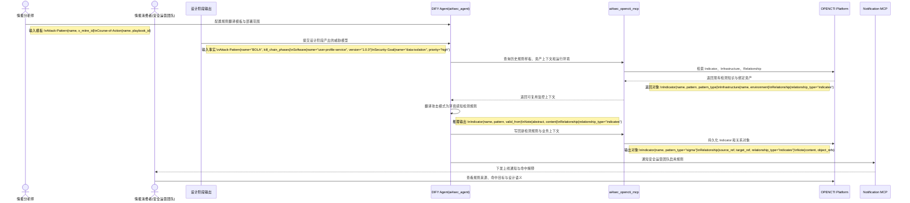

# VS4-E2E 环境感知监控闭环端到端用户故事

> 前置依赖约定：本用户故事默认继承并遵循 [00_通用架构约束与工具规范.md](./00_通用架构约束与工具规范.md) 中关于 DIFY Agent、OPENCTI、Notification MCP 与 STIX 2.1 的统一约束。

## 1、概要

本故事面向情报分析师与安全运营团队，描述如何把设计期识别出的威胁模式转换为运行期可执行的环境感知监控规则。核心不是生成一条普通告警，而是让 DIFY Agent 基于 OPENCTI 中的设计上下文、资产关系和既有防御知识，产出带业务语义的监控 `Indicator`，并把命中结果继续反馈回情报图谱。

## 2、执行全景图 (DIFY & OPENCTI 协作流)

## 3、故事：设计阶段识别的 BOLA 风险被转化为运行期高保真监控

### 第一幕：设计阶段输出威胁模型

在新服务上线前，情报分析师完成设计审查，识别出 `Attack-Pattern{name="BOLA"}` 针对 `Software{name="user-profile-service", version="1.0.0"}` 的潜在风险，并把安全目标 `Security-Goal{name="data-isolation", priority="high"}` 一并交给 DIFY Agent，要求系统把这类设计风险转换成运行期可用的规则。

### 第二幕：DIFY Agent 基于 OPENCTI 翻译检测规则

Agent 通过 `ai4sec_opencti_mcp` 查询 OPENCTI 中与该服务相关的历史 `Indicator`、环境 `Infrastructure` 和既有 `Relationship`，确认服务运行在对外暴露的生产环境中。随后 Agent 生成新的 `Indicator{pattern_type="sigma"}`，其规则内容明确描述“当请求参数中的用户 ID 与 JWT 身份不一致时触发告警”，并把规则与 `Attack-Pattern(BOLA)` 建立 `Relationship{relationship_type="indicates"}`。

### 第三幕：安全运营团队消费规则并将命中反馈回图谱

新规则被写入 OPENCTI 后，Notification MCP 向安全运营团队发送上线通知。运营团队不仅知道“这条规则会报警”，还知道“它对应哪一个设计威胁、保护哪一个业务目标、命中后应执行什么动作”。后续真实命中时，事件结果还可以继续回写 OPENCTI，推动监控与威胁模型持续校准。
