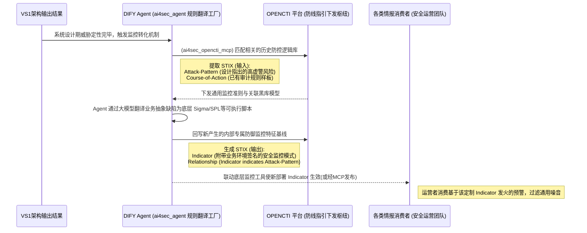

# VS4-E2E 环境感知监控闭环（端到端用户故事）

> **前置依赖约定**：本用户故事默认继承并遵循 [00_通用架构约束与工具规范.md](./00_通用架构约束与工具规范.md) 中关于 DIFY Agent 与 OPENCTI 平台的核心操作模式，以及 STIX 2.1 与 Notification 的强制架构准则。

## 价值流视角
- **价值流**: 价值流 4：环境感知监控闭环 (Context-Aware Monitoring Loop)
- **定义**: 这是一个 **独立的、连接性** 的价值流，将设计态的威胁 (Design) 转化为运行态的检测能力 (Operations)。

## 用户故事（跨流程）
- **作为**: 各类情报消费者及情报分析师
- **我希望**: 在系统帮助下可自动化地把抽象层面识别的设计缺陷转换为业务级别安全监控规则
- **以便**: 情报消费者能从被激活的早期预案接收高保真的定制化溯源情报，不必淹没在噪音内

## 验收标准
1. **自动翻译**: 输入 `Attack-Pattern` (针对特定组件) 自动生成 `Detection Rule` (Sigma/SPL)。
2. **上下文绑定**: 告警信息中包含设计文档中的 `Security-Goal` 与 `Asset` 上下文。
3. **闭环反馈**: 运营阶段的命中情况能反哺威胁模型的准确性。

## SHOWCASE（端到端）
### 场景
新上线的 "User-Profile-Service" 在 TARA 分析中识别出 "BOLA (Broken Object Level Authorization)" 风险。
系统自动生成一条专门监控该服务 `GET /api/user/{id}` 接口参数与 JWT Token 不一致的检测规则。

### 执行链路
1. **Design (VS1)**: 威胁建模识别出攻击模式 `sdo:Attack-Pattern (BOLA)` 针对组件 `sdo:Software (User-Profile-Service)`。
2. **Translation (VS4)**: 规则引擎分析攻击模式特征，结合组件技术栈 (FastAPI + Postgres)，生成 **Sigma 规则**。
3. **Deployment**: 规则自动下发至底座 `Situational Awareness` 模块。
4. **Detect (VS2)**: 攻击者尝试修改 URL ID 访问他人数据。
5. **Alert**: 触发 "Context-Aware Alert"，明确指出违反了设计阶段的 "数据隔离目标"。

### 业务价值
- **零配置上线**: 业务上线即具备专用监控能力。
- **高保真告警**: 告警基于特定业务逻辑，而非通用攻击特征，误报率极低。

## 交互流程图


## 数据流 (Data Flow)
```
sdo:Attack-Pattern (Predictive)
       + 
sdo:Software (Component Metadata)
       ↓
[Detection Rule Generator]
       ↓
sdo:Indicator (Internal-Rule)
       ↓
[Situational Awareness]
```
